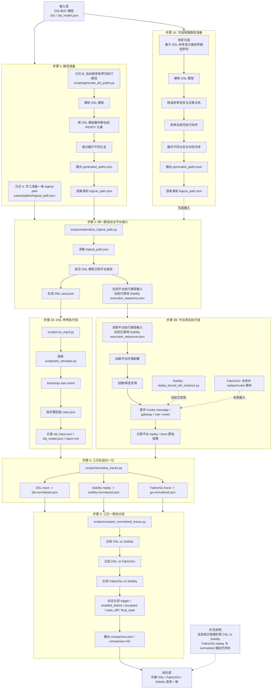

# Exp3 实验整体流程图

这份文档基于 [426学习文档.md](/home/shenxz-lab/code/ChainCollab/Experiment/new/exp3/426学习文档.md:490) 第 8 部分“文件职责总表”整理，目的是把 `exp3` 的整体思路压缩成一张可读的流程图。

适合第一次接触这个实验的人先看。  
看完这份图，应该能回答三件事：

- 实验的输入从哪里来
- 中间经过哪些大步骤和子步骤
- 每一步对应哪些关键文件和产物


## 1. 一张图看整体流程




## 2. 主流程拆解

### 步骤 1：路径准备

这一层的目标是先得到**平台无关**的执行路径。

这里先保留原来的两种入口：

- 手工写一条 `logical_path.json`
- 用 `scripts/generate_dsl_paths.py` 从 DSL 自动枚举路径

#### 1A. 方式 A：手工准备路径

当前你实际经常会先走这条更直接的工程路线：

1. 先选一个 BPMN/DSL case
2. 从已有例子里抽出一条或几条代表路径
3. 必要时手工改出不同分支、不同次序、非法路径
4. 把路径整理成统一的 `logical_path.json`

这条线的优点是：

- 直观
- 好控制
- 容易快速跑通整条实验链路

它的问题也很明确：

- 更像“代表性覆盖”
- 不容易把覆盖范围说得很严格

#### 1B. 方式 B：基于当前脚本自动枚举路径

这条线对应现在已经有的：

- `scripts/generate_dsl_paths.py`

它的内部子步骤是：

1. 解析 `.b2c` 或 `dsl_model.json`
2. 初始化 DSL 模拟器状态
3. 找出当前所有 `READY` 元素
4. 对每个可执行元素展开下一步
5. 递归形成多条路径
6. 输出 `generated_paths.json`
7. 再把其中每条路径单独落成 `logical_path.json`

这里要注意：

- 当前是**有界路径枚举**
- 不是无限意义上的“全路径证明”
- 循环会被深度上界和状态重复截断


### 步骤 1X：可选增强路径准备

这一层是额外并行加上的**待定可选方案**，不替换原来的步骤 1。

如果后面希望把“路径准备”讲得更严谨，可以补这条可选线。

它的内部子步骤是：

1. 解析 `.b2c` 或 `dsl_model.json`
2. 构造 DSL 参考状态与迁移关系
3. 初始化参考执行状态
4. 找出当前所有可执行动作或 `READY` 元素
5. 对每个可执行分支递归展开
6. 在并行场景中展开不同中间次序
7. 输出 `generated_paths.json`
8. 再把其中每条路径单独落成 `logical_path.json`

这里要注意：

- 这条线应标记为**可选增强方案**
- 它更接近“基于 DSL 的有界路径罗列”
- 不是无限意义上的“全路径证明”
- 循环会被深度上界和状态重复截断

这样处理后，图里就同时保留了：

- 原来的步骤 1
- 额外并行的步骤 1X

不会把你当前已经在用的路径准备方式改掉。

### 步骤 2：统一路径派生平台输入

这一层的目标是把同一条 logical path 翻译成不同执行线各自可消费的输入。

核心脚本：

- `scripts/materialize_logical_path.py`

内部子步骤是：

1. 读取 `logical_path.json`
2. 读取 DSL 模型
3. 判断哪些步骤在 DSL 里是自动完成的
4. 生成 DSL 用的 `case.json`
5. 生成平台执行输入
   - 当前已落地的是 Solidity `execution_sequence.json`
   - 后续 Fabric/Go 也应从同一条 logical path 派生自己的执行输入

这一层很关键，因为它保证：

- 三条执行线共享同一条逻辑路径来源
- 但又允许不同平台保留各自执行细节

当前已落地的是：

- DSL
- Solidity

Fabric/Go 之后也应接在这一层之后，派生出自己的 replay 输入。


### 步骤 3：平台执行

这一层可以理解成：

- 一条 DSL 参考执行线
- 一条平台真实执行线

其中“平台真实执行线”的机制其实对 Solidity 和 Fabric/Go 是通用的，只是当前真正落地的 replay 脚本只有 Solidity 版本。

#### 3A. DSL 参考执行线

目标是得到**参考语义轨迹**。

子步骤：

1. `run_exp3.py` 读取 `case.json`
2. `dsl_simulator.py` bootstrap 初始 start event
3. 按路径逐步回放
4. 在每一步记录：
   - 当前触发元素
   - 执行前可触发集合
   - 状态变化
   - 全局变量变化
   - 是否接受/拒绝
5. 输出 `dsl_trace.json` 等原始结果

#### 3B. 平台真实执行线

这一部分的目标，对 Solidity 和 Fabric/Go 其实是一样的：

- 使用已经生成好的执行路径输入
- 调用对应平台的 `invoke/replay` 脚本
- 得到该平台的真实执行轨迹

通用子步骤可以概括成：

1. 读取该平台的执行路径输入
2. 读取该平台环境配置
3. 创建实例或绑定已有实例
4. 按路径逐步调用平台侧 `invoke`
5. 记录平台原始 replay/trace
6. 输出后续归一化要用的原始结果文件

也就是说，这里的核心思路不是“Solidity 专属流程”，而是：

> 同一条逻辑路径先被翻译成平台输入，然后由不同平台各自的 replay/invoke 脚本去执行。

##### 3B1. Solidity 版本

当前已实现的是 Solidity 这一条：

1. `replay_bound_eth_instance.py` 读取 `execution_sequence.json`
2. 用配置文件绑定 FireFly / 合约环境
3. 调 `createInstance`
4. 逐步调用链上 `invoke`
5. 记录每次链上回放的原始结果
6. 输出 `replay_*.json`

##### 3B2. Fabric/Go 版本

Fabric/Go 在结构上应与 Solidity 对齐：

1. 读取由统一路径派生出的 Fabric 执行输入
2. 加载 Fabric 环境配置
3. 创建实例或绑定目标链码实例
4. 逐步调用 Fabric 侧 `invoke`
5. 记录 Fabric 原始执行轨迹
6. 输出 `go_trace.json` 或同类 replay 文件

但当前状态是：

- `fabric/` 目录已预留
- 还没有与 Solidity 对等的 replay/invoke 脚本
- 因此现在完整跑通的还是 `DSL vs Solidity`
- 后续补上 Fabric 脚本后，这一层的整体结构不需要改，只需要把 Fabric 分支接进来


### 步骤 4：三方轨迹归一化

这一层的目标是把三条执行线的原始输出，整理成**同一种比较口径**。

核心脚本：

- `scripts/normalize_traces.py`

子步骤：

1. 读取 DSL 原始轨迹
2. 读取 Solidity 原始 replay
3. 读取 Fabric/Go 原始执行轨迹
4. 对齐三方的 logical step 粒度
5. 补齐平台间“自动完成 vs 显式 invoke”的步骤差异
5. 输出：
   - `dsl.normalized.json`
   - `go.normalized.json`
   - `solidity.normalized.json`

没有这一步，前面三条执行线即使都跑完了，后面也没法直接比。

当前实现状态需要单独说明：

- DSL normalized 已有
- Solidity normalized 已有
- Fabric/Go normalized 仍待补


### 步骤 5：三方一致性比较

这一层的目标是给出**实验结论**。

核心脚本：

- `scripts/compare_normalized_traces.py`

子步骤：

1. 读取三份 normalized trace
2. 分别做三组比较：
   - `DSL vs Solidity`
   - `DSL vs Fabric/Go`
   - `Fabric/Go vs Solidity`
3. 在每组比较中检查每一步的：
   - `trigger`
   - `enabled_before`
   - `accepted`
   - `state_diff`
4. 比较最终：
   - `final_state.status`
   - `final_state.element_states`
   - `final_state.enabled_elements`
5. 汇总三组比较结果，判断是否整体一致
6. 输出：
   - `comparison.json`
   - `comparison.md`

最终回答的问题就是：

- 同一路径下，DSL、Fabric/Go、Solidity 是否三方一致
- 如果不一致，差异出现在哪一组比较、哪一步


## 3. 文件和流程的对应关系

```text
DSL/B2C 模型
  -> scripts/generate_dsl_paths.py
  -> generated_paths.json
  -> cases/<CaseName>/paths/<PathName>/logical_path.json

logical_path.json
  -> scripts/materialize_logical_path.py
  -> dsl/<CaseName>/paths/<PathName>/case.json
  -> solidity/<CaseName>/paths/<PathName>/execution_sequence.json

case.json
  -> scripts/run_exp3.py
  -> dsl_trace.json

execution_sequence.json
  -> scripts/replay_bound_eth_instance.py
  -> replay_*.json

dsl_trace.json + go_trace.json + replay_*.json
  -> scripts/normalize_traces.py
  -> dsl.normalized.json + go.normalized.json + solidity.normalized.json

dsl.normalized.json + go.normalized.json + solidity.normalized.json
  -> scripts/compare_normalized_traces.py
  -> comparison.json + comparison.md
```


## 4. 新人最该先记住的心智模型

如果只记一句话，可以记成：

> 先从 DSL 得到一条平台无关路径，再把它翻译成 DSL 和 Solidity 两个平台输入，分别执行、归一化，最后比较两边的行为轨迹是否一致。

如果记三句话，可以记成：

1. `logical_path.json` 是整个实验的统一路径源。
2. `materialize_logical_path.py` 负责把统一路径翻译成不同平台输入。
3. 真正的实验结论来自三方 `normalize -> compare`，不是只看某一边有没有跑通。


## 5. 当前实验边界

为了防止把这张图理解得过强，这里把边界再单独列出来：

- 目标结构是 `DSL vs Fabric/Go vs Solidity`
- 当前真正跑通的是 `DSL vs Solidity`
- Fabric/Go 线仍待补 replay 脚本
- 自动路径生成是**有界枚举**
- 当前不主张“无限路径全覆盖”
- 循环与复杂表达式分支都属于后续需要更严格补强的部分
