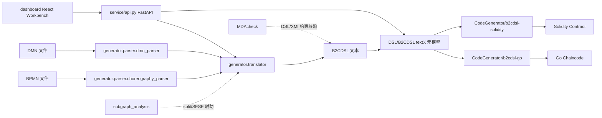

# newTranslator 系统总架构

## 1. 总体说明

`newTranslator` 的核心职责是把 **BPMN 协作流程模型** 与 **DMN 决策模型** 转成可执行的区块链工件。系统真实主链路不是“BPMN 直接生成 Go/Solidity”，而是：

`BPMN/DMN -> Choreography/Decision 解析 -> B2CDSL -> Go 链码 / Solidity 合约`

其中，**B2CDSL** 是整个系统最关键的中间层。

> 仓库里没有单独维护的系统总架构图文件；下面给出可直接用于后续绘图的模块关系。

## 2. 模块关系图

## 3. 分层视图

### 3.1 访问层

- `dashboard/`
  - 前端工作台。
  - 提供 BPMN/DMN 上传、链码生成、决策解析、参与者/消息/业务规则洞察。
- `service/api.py`
  - FastAPI 接口层。
  - 对外暴露 `/api/v1/chaincode/generate`、`/generate-eth`、`/compile`、`/getPartByBpmnC`、`/getMessagesByBpmnC`、`/getBusinessRulesByBpmnC`、DMN 决策分析等接口。

### 3.2 业务转换层

- `generator/parser/choreography_parser/`
  - 解析 BPMN Choreography。
  - 抽取参与者、消息、编排任务、网关、事件、业务规则任务、Oracle 任务、顺序流、消息流。
  - 形成 `Choreography` 图模型。
- `generator/parser/dmn_parser/`
  - 解析 DMN 决策表。
  - 提取决策节点、输入、输出、依赖关系，并识别主决策。
- `generator/translator.py`
  - 系统核心编排器。
  - 基于 BPMN 图模型推导全局变量、判断条件、业务规则映射与流程控制。
  - 输出 B2CDSL。
  - 同时可驱动 Solidity 渲染与 FFI 生成。

### 3.3 中间表示层

- `DSL/B2CDSL/b2cdsl/b2c.tx`
  - 定义 DSL 语法与元模型。
  - 统一承载 participants、globals、messages、gateways、events、businessrules、oracletasks、flows。

### 3.4 目标代码生成层

- `CodeGenerator/b2cdsl-go/`
  - 将 DSL 解析成 textX 模型后渲染为 Hyperledger Fabric Go 链码。
- `CodeGenerator/b2cdsl-solidity/`
  - 将 DSL 解析成 textX 模型后渲染为 Solidity 合约。

### 3.5 辅助分析层

- `subgraph_analysis/`
  - 对 BPMN 做 SESE 子图分析、分组标注。
  - 服务于 split mode 和流程子图划分。
- `MDAcheck/`
  - 将 DSL/XMI 纳入 OCL 约束校验。
  - 提供正例、变异负例、规则覆盖和报告。

## 4. 真实调用链

### 4.1 BPMN -> B2CDSL

1. `generator/bpmn_to_dsl.py` 读取 BPMN 文件。
2. `GoChaincodeTranslator` 调用 `Choreography.load_diagram_from_xml_file()` 解析 BPMN。
3. `ParameterExtractor` 从消息文档、业务规则输入输出、网关条件中推导全局变量和判断参数。
4. `DSLContractBuilder` 组装 participants/globals/messages/gateways/events/businessrules/oracletasks/flows。
5. 生成 `.b2c` 或 DSL 文本。

### 4.2 B2CDSL -> Go

1. textX 用 `b2c.tx` 解析 DSL。
2. `CodeGenerator/b2cdsl-go/b2cdsl_go/__init__.py` 把 Contract 适配成渲染上下文。
3. Jinja 模板 `templates/contract.go.jinja` 与 flow/action 子模板输出 Go 链码。

### 4.3 B2CDSL -> Solidity

1. textX 用 `b2c.tx` 解析 DSL。
2. `CodeGenerator/b2cdsl-solidity/b2cdsl_solidity/__init__.py` 构建执行布局和渲染上下文。
3. `templates/contract.sol.jinja` 输出 Solidity 合约。

## 5. 关键依赖关系

- `dashboard` 只依赖 `service`，不直接触达 `generator`。
- `service` 只编排 `generator`、`DSL`、`CodeGenerator`，不承载核心转换规则。
- `generator` 依赖 BPMN/DMN 解析器，并产出 DSL。
- `CodeGenerator` 不直接解析 BPMN，只消费 DSL。
- `MDAcheck` 与 `subgraph_analysis` 是旁路能力，不是主生成链路必经模块。

## 6. 实际工程上的一个注意点

- `GoChaincodeTranslator.generate_chaincode()` 这个方法名有历史遗留意味，**它实际生成的是 B2CDSL，不是最终 Go 链码**。
- 最终 Go/Solidity 代码生成发生在 `CodeGenerator` 或 `service/api.py` 的 `compile/generate-eth` 路径中。

## 7. 对应示例

本次整理好的完整示例位于：

- `docs/03_system_overview/end_to_end_example/example.bpmn`
- `docs/03_system_overview/end_to_end_example/example.dmn`
- `docs/03_system_overview/end_to_end_example/generated.dsl`
- `docs/03_system_overview/end_to_end_example/generated_chaincode.go`
- `docs/03_system_overview/end_to_end_example/generated_contract.sol`

