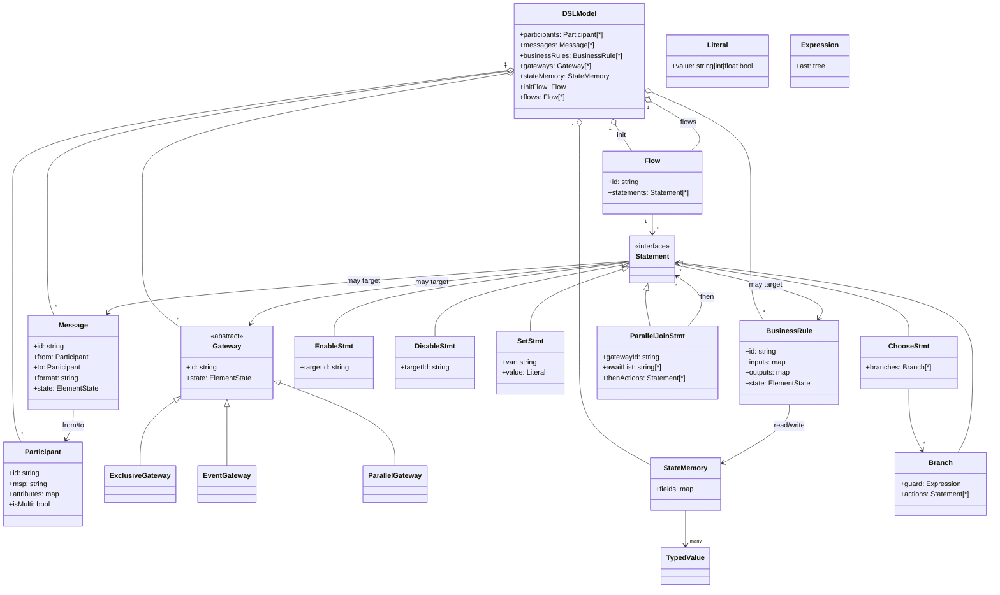

# B2C DSL 语法与有限状态机映射说明

> 面向论文/技术文档的独立章节：先给出 B2C 语法构成与 UML 结构，再阐述 FSM 映射方式，最后用一个简短案例贯穿语法与状态转移。

## 1 语法规范概要

- **基础元素**  
  - `participant <id>`：参与方定义，包含 `msp`、属性、是否多签。  
  - `message <id> from A to B format "<fmt>"`：消息定义，携带发送方/接收方/格式。  
  - `business_rule <id>`：与 DMN 规则关联，包含输入/输出映射。  
  - `gateway <id> type exclusive|event|parallel`：网关定义。  
  - `state memory { <field>: <type>; ... }`：全局变量集合，类型支持 `bool`/`int`/`float`/`string`。
- **流程块**  
  - `flow <name> { <statements> }`：流程片段，由若干语句组成。  
  - 语句类型：`enable/disable <element>;`、`set <global> = <literal>;`、`choose { if <expr> then ...; else ...; }`、`parallel gateway <id> await a, b then <actions>;`。
- **条件表达式**  
  - 比较：`== != > < >= <=`，与字面量/变量结合。  
  - 逻辑：`&& || !`，支持括号。  
  - 变量来源：`state memory` 字段、消息字段、业务规则输出、BPMN sequence flow 条件/name。
- **初始化**  
  - `init { participants... messages... gateways... business_rules... }`；StartEvent 置 `ENABLED`，其他元素初始为 `DISABLED`。

## 2 UML 结构图（语义模型）



## 3 FSM 映射与控制流

- **状态集合**：所有元素共享离散状态 `DISABLED | ENABLED | WAITING | COMPLETED`；`StateMemory` 字段扩展了 FSM 的数据维度。整体状态 = 元素状态向量 × 状态内存。  
- **初始状态**：`init` 中 StartEvent 为 `ENABLED`，其他元素 `DISABLED`，`StateMemory` 用 DSL 字面量或推断默认值填充。  
- **转移函数（守卫+动作）**：  
  - `enable x`：守卫真时，将目标元素置 `ENABLED`。  
  - `disable x`：将目标置不可用，剪枝后续路径。  
  - `set g = v`：更新 `StateMemory`，影响后续守卫求值。  
  - `choose { if cond then A; else B; }`：布尔守卫选择分支；事件网关按“先到先得”禁用其他分支。  
  - `parallel gateway ... await a, b then ...`：转移前检查所有前置元素为 `COMPLETED`，否则拒绝转移；满足后一次性解锁后续动作。  
- **控制流与网关**：  
  - 互斥网关：多个条件守卫，首个满足触发，其余可显式 `disable`。  
  - 事件网关：任一事件先到即执行，其余分支被禁用。  
  - 并行网关：合流需要“全部完成”守卫；分流可直接 `enable` 多个分支。  
- **确定性**：所有转移仅依赖当前状态与守卫表达式，无随机性，满足链码执行的确定性要求。

### 3.4 控制结构与 FSM 映射表

| DSL 控制结构 | 语法示例 | FSM 映射 | 控制流语义 |
| --- | --- | --- | --- |
| 起始/结束事件 | `start event S; end event E;` | S 构造初始状态 `s0` 并置后继 `ENABLED`；E 达到 `COMPLETED` 进入终止集 `F` | 定义入口/出口、终止条件 |
| 协作任务/消息 | `message M from A to B ...`，`flow { enable M; }` | 任务触发后 `ENABLED -> COMPLETED`，可写入状态内存 | 驱动主干转移、携带数据 |
| 顺序流（含条件） | `if cond then enable X;` 或 SequenceFlow 条件/name | 前驱 `COMPLETED` 且守卫真才使能后继，否则拒绝转移 | 依赖/守卫剪枝不可行路径 |
| 排他网关（Exclusive） | `choose { if c1 then ...; else ...; }` | 带守卫的选择转移；满足分支 `ENABLED`，其余可 `DISABLED` | 单一路径生效，消除歧义 |
| 并行网关（Parallel split/merge） | `parallel gateway G await A, B then ...;` | 合流守卫：全部前驱 `COMPLETED` 方可触发；分流可一次性 `enable` 多分支 | 同步/并发控制，防早触发 |
| 事件网关（Event-based） | `choose { on E1 -> ...; on E2 -> ...; }` | 竞争输入事件；首个触发分支转移，其余分支标记 `DISABLED` | “先到先得”，固化竞争结果 |
| 业务规则/DMN | `business_rule BR ...` | 规则完成更新 `StateMemory`，作为后续守卫输入 | 数据驱动的转移与赋值 |

## 4 简单案例（配送可用性）

### 4.1 DSL 片段

```b2c
state memory {
    IsAvailable: bool;
}

init {
    participant Buyer;
    participant Seller;
    message Check from Buyer to Seller format "json";
    message Confirm from Seller to Buyer format "json";
    gateway G1 type exclusive;
}

flow check_and_confirm {
    enable Check;
    choose {
        if IsAvailable == true then enable Confirm;
        else disable Confirm;
    };
}
```

### 4.2 FSM 解释

1. 初始：`Check` ENABLED，其余 DISABLED，`IsAvailable` 未赋值（或默认 false）。  
2. 执行 `Check_Send` → 将 `Check` 置 `WAITING`/`COMPLETED`，并可在业务逻辑中 `set IsAvailable = <bool>`。  
3. 进入 `choose`：守卫 `IsAvailable == true` 为真则转移到 `enable Confirm`，否则剪枝，`Confirm` 永不激活。  
4. `Confirm_Send` 只有在被 ENABLED 后才能执行，形成标准的状态机转移链条。

### 4.3 与链码的对应

- Go/Solidity 合约中为 `StateMemory` 生成 `bool IsAvailable` 字段，默认值 false。  
- `Check` 方法完成后可写入 `IsAvailable`，`G1` 的互斥分支以 `if (IsAvailable)` 为守卫，执行 `ChangeMsgState(Confirm, ENABLED)` 或不启用。  
- 未满足守卫时返回错误，不修改状态，保持 FSM 的“拒绝转移”语义。

---

该文件可直接纳入论文/技术报告，Mermaid 图可在 VS Code 或 `mmdc` 渲染。若需与完整系统架构结合，可与 `docs/system_paper.md` 交叉引用。
