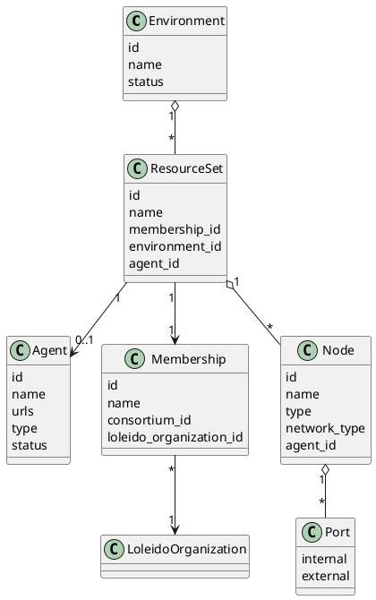
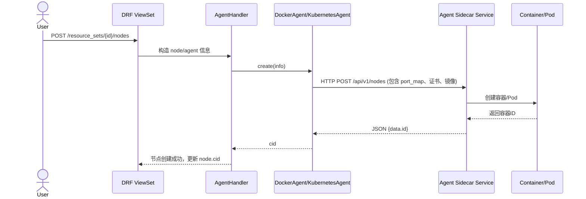

# Backend Architecture Digest

本文面向需要快速熟悉 `/src/backend` 的同学，覆盖模型、接口、Agent 流程以及后续建设建议。代码引用可在仓库中直接定位。

## 1. 核心模型（`api/models.py`）

- **Environment → ResourceSet → Node**：Environment 属于 Consortium，ResourceSet 则绑定 Environment + Membership，再挂接 Agent；Node 依附 ResourceSet，并记录网络/类型等运行参数。
- **Agent**：抽象出节点承载侧，包含 `urls`（控制端点）、`type`（docker/kubernetes）、`free_ports` 等，用于统一调度。
- **Membership / LoleidoOrganization**：定义联盟组织及其成员关系，是 ResourceSet 授权与 Fabric 身份归属的根。
- **FabricResourceSet / Port / FabricCA / FabricPeer**：补充 Fabric 网络所需的 MSP/端口/证书结构。
- 数据一致性增强：ResourceSet 与 FabricResourceSet 调整为 1:1（OneToOne），Port 增加 `(node, internal/external)` 唯一约束，ResourceSet 在同一 Environment 下对同一 Membership 唯一，Agent 及其 K8s 配置删除策略改为 `SET_NULL / PROTECT`，避免误删导致整批节点级联消失。



## 2. 关键接口清单（`api_engine/urls.py` 及各 ViewSet）

| 模块 | 方法 | URL | 说明 |
| ---- | ---- | --- | ---- |
| Agent | `GET / POST` | `/api/v1/agents` | 列举/创建 Agent（Docker/K8s 配置上传）。 |
| ResourceSet | `GET` | `/api/v1/environments/{env_id}/resource_sets` | 查询环境下资源组，可按 org/membership 过滤。 |
| ResourceSet | `POST` | `/api/v1/environments/{env_id}/resource_sets` | 指定 membership+agent 创建资源组。 |
| Node | `GET` | `/api/v1/resource_sets/{rs_id}/nodes` | 查询节点，支持类型、名称、agent 过滤。 |
| Node | `POST` | `/api/v1/resource_sets/{rs_id}/nodes` | 根据 `type/num/name` 创建 Fabric 节点，自动分配端口、触发 Agent 创建容器。 |
| Fabric CA | `POST` | `/api/v1/resource_sets/{rs_id}/cas/ca_create` | 创建 CA、写入 MSP/证书。 |
| Fabric Identity | `POST` | `/api/v1/fabric_identities` | 平台用户创建 Fabric 身份并与 Firefly 对接。 |
| Fabric Identity | `POST` | `/api/v1/fabric_identities/create_fabric_identity` | 网关调用；通过 API key/secret 自动注册身份。 |
| Environment | `POST` | `/api/v1/consortiums/{cid}/environments` | 在联盟下创建 Environment。 |
| EnvironmentOperate | `POST` | `/api/v1/environments/{env_id}/init` | 一键初始化系统资源组、CA、Orderer、Peer。 |
| Ethereum ResourceSet | `POST` | `/api/v1/resource_sets/{rs_id}/eth/node_create` | 通过 Agent sidecar 创建以太坊节点实例。 |

> 其他模块（Channel、Chaincode、Firefly、BPMN/DMN、Search、API Secret Key 等）均已在 `api_engine/urls.py` 注册，可按需深入。

## 3. Agent & 容器编排流程



### Celery 驱动的 Agent 容器（`api/tasks/agent.py`）

- `operate_node` 任务根据 Node 记录和 `Port` 映射拼出环境变量，直接 `docker.from_env().containers.run(node.agent.image, env=...)`。
- Agent 镜像启动后再回调 API（`NODE_DETAIL_URL`, `NODE_UPLOAD_FILE_URL`）上报状态/文件，形成“控制器 → Agent 镜像 → 后端回调”的闭环。

> `api/services/agent.py` & `api/services/nodes.py` 刚引入的服务层统一封装 Agent 选择、异常处理与节点元数据构建，使 ViewSet/任务免于重复拼装字典与 try/except。

## 4. Environment 初始化流程

```mermaid
flowchart TD
    A[POST /environments/{id}/init] --> B[创建 system org/membership]
    B --> C[创建默认 Agent (DEFAULT_AGENT)]
    C --> D[创建系统 ResourceSet + FabricResourceSet]
    D --> E[调用 /cas/ca_create & enroll 接口生成 CA/MSP]
    E --> F[注册 Orderer/Peer 身份]
    F --> G[POST /nodes 创建 Orderer/Peer 节点]
    G --> H[Environment 状态置 INITIALIZED]
```

## 5. 端口与资源分配（`api/utils/port_picker.py`）

- `find_available_ports` 先读 `Port` 表过滤已占用端口，再通过 socket 测试实际可用性，必要时递归重试。
- `set_ports_mapping(..., new=True)` 将 `{internal, external}` 写入 `Port`；KubernetesAgent 在 NodePort 生成后也会回写数据库，保持 UI 与真实端口同步。

## 6. 现状问题与解决顺序

1. **文档/可视化补全**：本文件+自动生成 API 列表作为 onboarding 资料；建议在仓库 README 链接此文档。
2. **Agent 健康检查**  
   - 为 Docker/K8s Agent sidecar 增加 `/healthz` 轮询，`Agent` 表记录最后心跳时间。  
   - Node 创建前校验 Agent 在线，否则直接阻断。
3. **幂等与回滚**  
   - `EnvironmentOperateViewSet.init` 需检测系统资源是否已创建，失败时回滚 LoleidoOrganization/Membership/ResourceSet。  
   - Node/CA 创建失败时清理临时证书、端口映射。
4. **自动化测试**  
   - Model 层：对 Agent/ResourceSet/Node 的创建联动写单测。  
   - API：利用 DRF APITestCase 覆盖 `/agents`, `/resource_sets`, `/nodes` 成功与错误路径。  
   - Celery：引入 `CELERY_TASK_ALWAYS_EAGER=True` 的集成测试，验证 `operate_node` 环境变量完整性。
5. **观测性与日志**  
   - 统一结构化日志（request_id / node_id）便于跨服务追踪，在 `AgentHandler`、Celery 任务中补 trace-id。  
   - `api/lib/agent/kubernetes/common.py` 的 `LOG.error` 需要附带 namespace/name 以便定位。
6. **API 防护**  
   - Fabric Identity 网关接口目前仅做 key/secret 校验，可增加 IP allowlist 或签名提升安全性。  
   - `/resource_sets/{id}/nodes` 缺少 RBAC 细分（注释掉的 operator 校验），建议恢复/补充。

## 7. 建议的执行顺序

1. **建立健康检查与幂等**（步骤 2-3）——直接影响稳定性。  
2. **补自动化测试**（步骤 4）——为后续改动提供信心。  
3. **完善日志与观测**（步骤 5）——便于问题定位。  
4. **加强接口防护**（步骤 6）——保障多租户安全。  
5. **拓展文档**——把本指南融入官方 README，并根据实际演进进行版本化维护。

---

如需更细的模块图或接口字段定义，可在本文件基础上逐步扩展。欢迎补充更多 Mermaid/PlantUML 场景以覆盖 BPMN、Firefly 等子系统。
