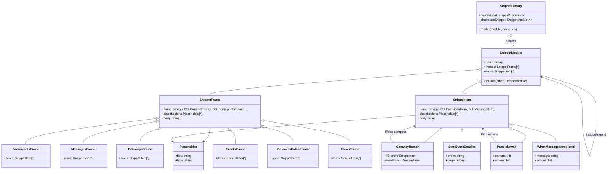
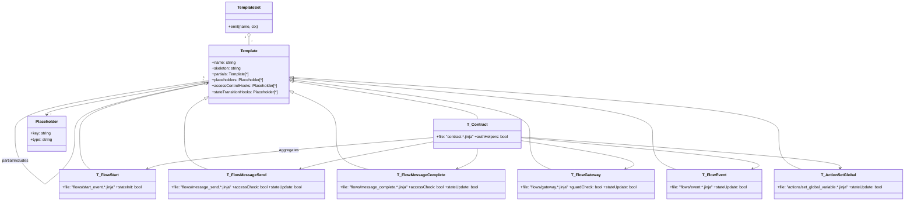
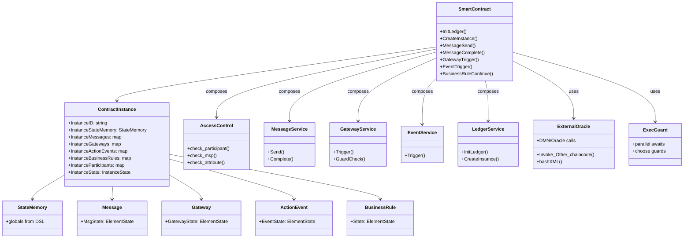

# BPMN → B2C DSL → 智能合约 的学术化描述

> 面向论文写作，分两部分描述：BPMN→DSL 与 DSL→合约。包含转换方法、参与元素、模板/片段的形式化描述，以及 LaTeX 伪代码算法。

## 1 总览
- **输入层（PIM/CIM）**：BPMN 编舞/协作模型，承载参与者、协作任务、消息流、顺序流、条件、网关、事件，属于平台无关/计算无关的业务语义。
- **中间层（PSM-DSL）**：B2C DSL（participants / globals / messages / gateways / events / flows），将控制流与数据依赖显式化，形成可执行的有限状态机模型。
- **输出层（实现工件）**：链码/合约（Go Fabric、Solidity EVM），由 snippet 库 + Jinja 模板组合生成，满足平台约束（确定性、状态隔离、语言规范）。
- **设计原则**：语义保真（保持 BPMN 条件、并行、事件竞争语义）、确定性（链码可复现）、可组合（模板/片段可替换）、平台无关到平台特定的渐进映射。

## 2 BPMN → B2C DSL

### 2.1 参与元素与映射
- **Participants**：BPMN pool/participant → DSL `participant` 条目。
- **Messages/Tasks**：Choreography task/message flow → DSL `message`，记录 sender/receiver/format。
- **Sequence Flow 条件**：`conditionExpression` 或 `name` → DSL `choose` 守卫，提取变量加入 `globals`。
- **Gateways**：exclusive/event/parallel → DSL `gateway` + `flows` 中的 `choose` / `parallel gateway await ... then ...`。
- **Events**：Start/End → DSL `events` 与 `flows` 中的 `start event ... enables ...`。
- **Globals**：来自消息字段、业务规则输入/输出、条件表达式中的标识符，推断类型填入 `globals`。

- **事件/网关建模**：事件作为 FSM 的初始/终止锚点；网关通过守卫与同步规则编码到 DSL 的 `choose`/`parallel await` 结构，保持 BPMN 的控制流语义。

### 2.2 Snippet 库的学术化表示
- 定义 snippet 库为有序集合 $\mathcal{S} = \{\sigma_1,\sigma_2,\dots\}$，每个 $\sigma$ 是带占位符的 DSL 片段模板（如 enable、choose、parallel await）。
- 占位符集合 $\mathcal{P}$：元素标识、条件表达式、状态写入、动作序列。
- 渲染函数 $render: \mathcal{S} \times \mathcal{P} \rightarrow$ DSL 子串。
- 可视为受限的重写系统：BPMN 结构（任务/网关）→ 选择对应的 $\sigma$ → 通过占位符替换得到 DSL 片段，保证语义单调映射。

### 2.3 转换算法（BPMN→DSL）

```latex
\begin{algorithm}[H]
\caption{BPMN2DSL Transformation}
\KwIn{BPMN model $M$}
\KwOut{DSL text $D$}
Initialize sets $P, Msg, Gtw, Ev, Glb, Flows$\;
$P \gets \textsc{CollectParticipants}(M)$;   \tcp*[r]{write participants section}
$Msg \gets \textsc{CollectMessages}(M)$;     \tcp*[r]{write messages section}
$Gtw \gets \textsc{CollectGateways}(M)$;     \tcp*[r]{write gateways section}
$Ev  \gets \textsc{CollectEvents}(M)$;       \tcp*[r]{write events section}
$\Phi \gets \textsc{ExtractConditions}(\textsc{SequenceFlows}(M))$\;
$\Psi \gets \textsc{ExtractIO}(M)$; \tcp*[r]{BR I/O, message fields}
$Glb \gets \textsc{InferTypes}(\Phi \cup \Psi)$; \tcp*[r]{write globals}
\ForEach{$f \in \textsc{SequenceFlows}(M)$}{
    $\sigma \gets \textsc{SelectSnippet}(f, \mathcal{S})$\;
    $frag \gets render(\sigma, \mathcal{P}_f)$\;
    $Flows \gets Flows \cup \{frag\}$\;
}
$D \gets \textsc{Assemble}(P,Glb,Msg,Gtw,Ev,Flows)$\;
\Return $D$\;
\end{algorithm}
```

**复杂度与性质**：收集与推断步骤为线性时间 $O(|V|+|E|)$（遍历节点与边），渲染为线性级串接；转换保持控制流守卫与同步约束的语义等价性（对可观测行为）。

## 3 B2C DSL → 智能合约（Go / Solidity）

### 3.1 参与元素与映射
- **StateMemory** → 合约内的结构体字段（Go struct / Solidity state variables）。
- **ElementState** → 离散状态枚举，驱动 enable/disable/complete 的状态机。
- **Flows** → 合约方法集合：消息 send/complete、业务规则 continue、网关入口等。
- **守卫与赋值**：`choose`/条件表达式 → 合约内的 if/require；`set` → 对状态内存字段写操作。
- **并行/事件网关**：`parallel await` → 多前置 COMPLETED 检查；事件网关 → “先到先得”禁用其他分支。

### 3.2 Jinja 模板的形式化概念
- 将模板视为带占位符的代码骨架 $T = (C, \mathcal{P})$，其中 $C$ 为常量片段，$\mathcal{P}$ 为占位符集合。
- 渲染函数 $emit(T, \theta)$：用绑定 $\theta: \mathcal{P}\rightarrow$ 字符串 将骨架实例化为可编译代码。
- 模板分层：合同骨架（imports、struct）、动作模板（消息、规则、网关）、工具函数（读写状态）。
- 可形式化为：$\llbracket T \rrbracket_\theta = \textsf{concat}(c_i \mid c_i \in C \cup \theta(p_j))$，其中 $c_i$ 为常量片段，$\theta(p_j)$ 为占位符实例。

### 3.3 转换算法（DSL→合约）

```latex
\begin{algorithm}[H]
\caption{DSL2Contract Rendering}
\KwIn{DSL AST $A$, template set $\mathcal{T}$, snippet library $\mathcal{S}$}
\KwOut{Contract code $C_{go}$ or $C_{sol}$}
Parse $A$ to obtain $Glb, Elem, Flows$\;
Select language-specific templates $\mathcal{T}_{lang} \subseteq \mathcal{T}$\;
Build context $\theta$ (type map, state fields, method names, guards)\;
$c_0 \gets emit(T_{contract}, \theta)$\;
\ForEach{$e \in Flows$}{
    $\sigma \gets \textsc{SelectSnippet}(e, \mathcal{S})$\;
    $s_e \gets render(\sigma, \theta_e)$\;
    $T_e \gets \textsc{SelectTemplate}(e, \mathcal{T}_{lang})$\;
    $c_e \gets emit(T_e, \theta_e \cup s_e)$\;
    Append $c_e$ to code list\;
}
$C \gets c_0 \Vert c_1 \Vert \dots$; \tcp*[r]{concatenate}
\Return $C$\;
\end{algorithm}
```

**正确性与确定性**：渲染结果是 DSL AST 的函数；状态转移仅依赖当前世界状态与输入参数，无外部随机性，满足 Fabric/EVM 的确定性约束。

### 3.4 片段与模板的学术化展示
- **Snippet 视为重写规则**：如 `enable X;` → `ChangeMsgState(X, ENABLED)` 或 `ChangeGtwState`，`parallel await A,B` → `if !(A==COMPLETED && B==COMPLETED) return error; ...`。
- **模板视为形如 $(\Sigma^\* \times \mathcal{P})$ 的笛卡尔积**：固定代码串与占位符的组合，渲染即替换并连接。
- **确定性**：渲染结果仅由 AST 与绑定决定，不依赖运行时输入，保证链码可复现与可验证。

#### UML 类图 1：Snippet 之间的包含/嵌入关系

> 对应文件：`generator/snippet/newSnippet/snippets.json` 与 `snippet.py`（DSL 片段），`generator/snippet/chaincode_snippet/snippet.json`（旧版链码片段）。两模块可并存，渲染时选择其一。

#### UML 类图 2：Template 之间的包含/嵌入关系

> 对应文件：`CodeGenerator/b2cdsl-go/templates/contract.go.jinja` + `flows/*.jinja` + `actions/set_global_variable.go.jinja`；Solidity 为 `CodeGenerator/b2cdsl-solidity/templates/contract.sol.jinja`（单文件骨架，可作部分被包含）。

#### 智能合约结构图（生成结果）

> 模板对照：`T_Contract` 塑造 SmartContract/ContractInstance 等核心结构；`T_FlowMessage*`/`T_FlowGateway`/`T_FlowEvent` 对应 MessageService/GatewayService/EventService；`T_ActionSetGlobal` 写入 StateMemory；`T_Sec*`、`T_ExecGuard` 等片段填充 AccessControl 与守卫逻辑，外部调用由 ExternalOracle 体现。

**Snippet vs. Template 流程差异**  
- BPMN→DSL（snippet 驱动）：聚焦网关/条件/事件语义保真，抽取并注册全局变量，推断类型，按元素类型选择 DSL 片段（StartEventEnables, WhenMessageCompleted, GatewayBranchIf/Else, ParallelAwait 等）拼接六大段。  
- DSL→合约（模板装配）：聚焦目标语言骨架与文件组织，选择 contract/flow/action 等模板，插入守卫和状态转移片段，处理 imports/struct/方法签名、序列化与平台约束（确定性、状态持久化）。  
- 区别：Snippet 层解决“语义→DSL 片段”的重写，Template 层解决“片段→完整源文件”的组装；前者偏语义抽象，后者偏代码生成与平台适配。

**文字化补充（Snippet）**：`snippets.json` 将 DSL 顶层 Frame（contract/participants/.../flows）与各类 Item（ParticipantItem、GatewayBranchIf/Else、ParallelAwait 等）拆分，支持 include/extend 组合。渲染时先选择模块，再按元素类型选取 Frame+Item 拼接，保持 DSL 语义原子化与可复用。

**文字化补充（Template）**：Go 模板集分为合同骨架 + 多个 flow 模板 + 动作模板，彼此以 partials/ include 方式装配；Solidity 模板为单文件骨架，必要时可被其他语言级别的包装模板包含。占位符覆盖 imports、类型、方法体、守卫逻辑等，强调文件级组织与平台特定约束（确定性、序列化、事件）。 

## 4 简述生成管线
1. **BPMN→DSL**：按 2.3 生成 `*.b2c`，产出 DOT/PNG 结构图（可选）。
2. **DSL→Go/Solidity**：按 3.3 渲染 Jinja，输出 `chaincode.go` / `chaincode.sol`。
3. **部署**：Go 链码部署 Fabric；Solidity 合约部署 EVM，均保持 FSM 的确定性执行。

**可用性与扩展性**：模板/片段可插拔，便于支持新平台；类型推断与守卫编织确保业务约束不丢失；整体管线自 PIM/CIM 过渡到 PSM，再到代码工件，符合模型驱动工程范式。  
