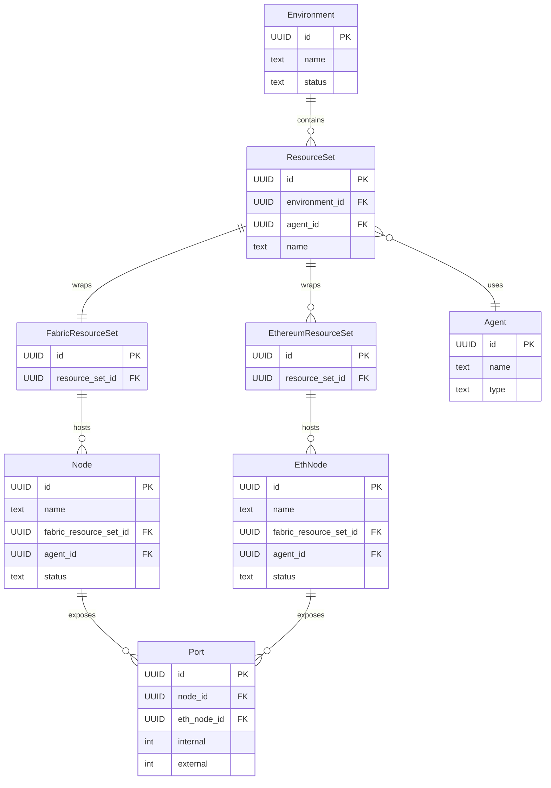
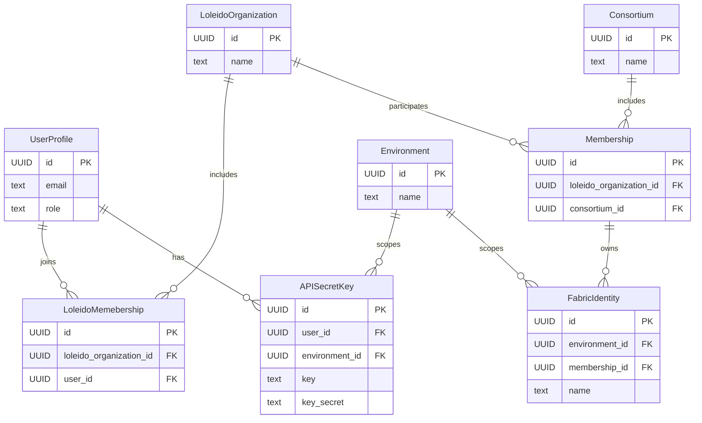
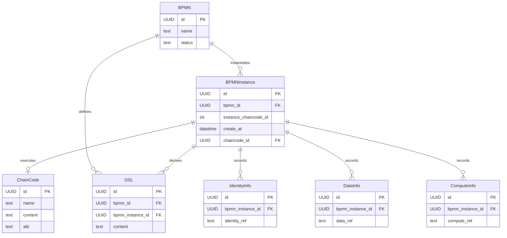
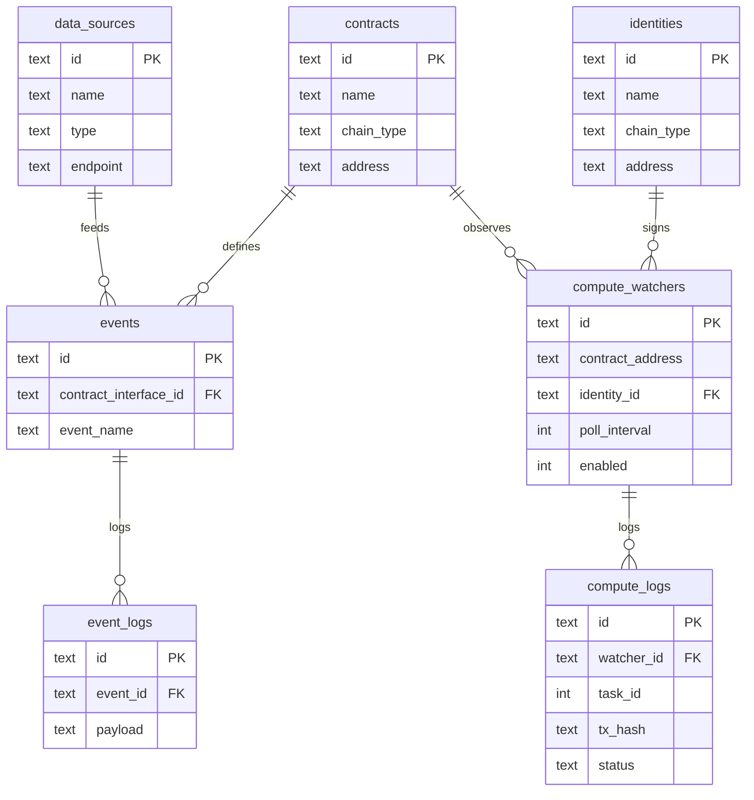

# ER 图（四大类：资源、身份、BPMN→合约、Oracle-node）

本文档给出四个独立 ER 图，分别覆盖：  
1) 后端资源相关数据结构  
2) 后端身份相关数据结构  
3) 后端 BPMN 到智能合约相关数据结构  
4) oracle-node 运行态数据结构（SQLite）

---

## 1) 后端资源相关（资源集合/环境/节点/端口）

要点：
- `ResourceSet` 是组织在某环境中的资源集合，桥接身份与运行态资源。
- `Agent` 是执行面，节点/端口最终落在 Agent 上。
- `FabricResourceSet` / `EthereumResourceSet` 区分链类型。

---

## 2) 后端身份相关（组织/联盟/成员/用户/凭据）

要点：
- `Membership` 将组织与联盟绑定，是权限与资源分配的核心锚点。
- `APISecretKey` / `FabricIdentity` 为身份与链上操作提供凭据。

---

## 3) BPMN → 智能合约（模型/实例/链码/通道）

要点：
- `BPMN` 存模型与生成产物，`ChainCode` 表示部署后的合约元数据。
- `BPMNInstance` 体现运行时实例与链上实例 ID 绑定。
- `DMN` 与 `BPMNInstance` 通过绑定记录衔接。

---

## 4) oracle-node（运行态 SQLite）

要点：
- `contracts/events/event_logs` 形成“事件订阅 → 触发 → 记录”的闭环。
- `identities` 提供链上身份与私钥支撑计算任务签名。
- `compute_watchers/compute_logs` 记录链外计算与回写状态。
