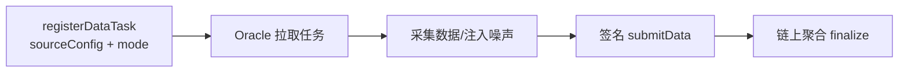
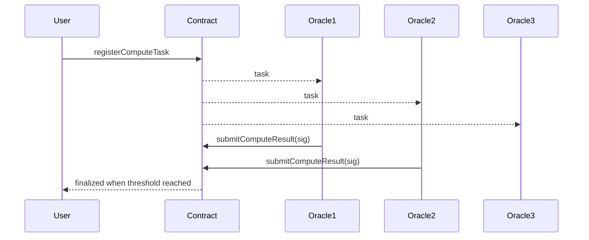

# Oracle 技术研究与实现概述（论文写作素材）

本节聚焦于两部分：
(1) 智能合约接口设计；(2) 预言机节点运行模式。
其余内容可在正文中简略提及或移至附录。

针对多方协作流程中对链外数据与计算结果的依赖问题，本文设计了一种面向流程执行的分层预言机架构，由链上合约层与链下预言机节点层构成。其中，链下预言机节点内部由控制平面与执行平面组成：控制平面负责任务配置、身份管理与运行监控；执行平面负责链外数据采集与可验证计算任务执行，并完成签名提交。链上合约层负责预言机任务注册、结果确认与状态管理，只接收并验证一致结果，为流程执行提供确定性输入。该架构遵循“链下消解不确定性、链上验证一致结果”的设计原则，将非确定性操作严格限制在链下完成，从而保证流程执行与合约状态更新的确定性与可验证性。

## 1. 智能合约接口设计（UnifiedOracle）

### 1.1 设计目标

- 数据任务：支持 MEAN / MEDIAN / WEIGHTED_MEAN 聚合。
- 计算任务：支持链下计算结果的阈值签名确认。
- 可观测性：提供健康性与任务统计接口，便于监控与实验。
- 任务配置链上化：数据任务携带 sourceConfig（JSON 字符串），确保 Oracle 节点可仅通过链上读取获取完整任务配置。

### 1.2 数据任务相关接口

注册与提交
- registerDataTask(string sourceConfig, mode, allowedOracles, weights, minResponses)
  - sourceConfig：数据源配置（JSON），合约内部生成 sourceHash 用于索引。
  - mode：聚合模式（MEAN / MEDIAN / WEIGHTED_MEAN）。
  - allowedOracles：可参与节点列表。
  - weights：仅 WEIGHTED_MEAN 使用，长度需与 allowedOracles 一致。
  - minResponses：最小响应数，达到后触发聚合。
- submitData(taskId, value, signature)
  - signature：对 keccak256(taskId, value) 的签名。

查询
- getDataTask(taskId) -> (requester, sourceHash, mode, minResponses, finished, finalValue, submissionCount)
- getDataTaskSummary(taskId) -> (sourceHash, mode, finished, finalValue, submissionCount, minResponses)
- getDataSourceConfig(taskId) -> sourceConfig (string)
- getAllDataTaskIds() -> uint256[]

### 1.3 计算任务相关接口

注册与提交
- registerComputeTask(computeType, payloadHash, allowedOracles, threshold)
  - computeType：计算类型标识。
  - payloadHash：计算输入哈希。
  - threshold：一致结果所需最小签名数。
- submitComputeResult(taskId, result, signature)
  - signature：对 keccak256(taskId, payloadHash, result) 的签名。

查询
- getComputeTask(taskId) -> (requester, computeType, payloadHash, threshold, finished, finalResult)
- getComputeTaskSummary(taskId) -> (computeType, payloadHash, finished, finalResult, threshold, responseCount)
- getAllComputeTaskIds() -> uint256[]

### 1.4 健康性与统计接口

- getHealth() -> (owner, dataTasks, computeTasks, activeOracles, blockNumber)
- getCounts() -> (dataTasks, computeTasks, activeOracles)
- isOracleActive(address)
- oracleCount()

## 2. 预言机节点运行模式

### 2.1 运行方式概览

Oracle 节点在启动后进入“任务拉取 → 数据采集 → 签名提交”的闭环：

1) 任务发现
- 通过链上合约接口获取任务列表（getAllDataTaskIds / getAllComputeTaskIds）。
- 拉取任务摘要与配置（getDataTaskSummary / getDataSourceConfig）。

2) 数据采集（数据任务）
- 解析 sourceConfig，定位数据源（HTTP API、数据库或本地传感器）。
- 获取数据并进行预处理（单位换算、时间对齐等）。
- 可注入噪声/偏差以模拟现实环境不一致。

3) 签名与提交
- 生成签名并调用 submitData 或 submitComputeResult。
- 合约验证签名与 allowedOracles 权限。

4) 任务完成
- 数据任务达到 minResponses 即聚合并 finalize。
- 计算任务达到 threshold 即 finalize。

### 2.2 数据任务的执行细节

- 节点只依赖链上读取即可获得 sourceConfig（链上完整配置）。
- 对同一任务，不同节点可来自不同数据源或加入噪声，从而形成可观测的聚合误差。
- 通过调整 minResponses 与 allowedOracles，可模拟不同数据可信度场景。

### 2.3 计算任务的执行细节

- 任务输入由 payloadHash 标识，防止输入被替换。
- 节点签名提交后，合约统计结果一致性与阈值。

## 3. Mermaid 图表

### 3.1 数据任务流程



### 3.2 计算任务流程



## 4. 实验验证与分析（LaTeX 章节）

> 说明：以下内容为 LaTeX 章节草稿，可直接复制到论文中；实验数据先用占位符表示，后续替换为真实数据。

```latex
\section{实验验证与分析}
围绕所提出的预言机机制，本文设计了多组实验以验证其在多方协作流程中的有效性与鲁棒性。
实验内容包括多源数据噪声环境下不同聚合策略的稳定性分析、恶意节点干扰场景下结果偏移程度对比，
以及计算型预言机阈值一致性机制的正确性验证。实验结果表明，相较于单节点预言机方案，多节点协同与结果聚合机制
在数据可信性与系统鲁棒性方面具有明显优势，且通过将预言机结果与流程语义绑定，能够在保证链上确定性执行的前提下，
为复杂协作流程提供可靠的链外信息支撑。

\subsection{实验设计}
\textbf{实验一：多源噪声下聚合稳定性。}
设置多节点对同一数据源进行采集，加入不同强度的噪声与采样偏差。比较 MEAN、MEDIAN 与 WEIGHTED\_MEAN 的稳定性与误差。

\textbf{实验二：恶意节点干扰场景。}
在节点集合中引入恶意节点提交极端值，观察聚合结果偏移程度与鲁棒性差异，评估中位数与加权均值的抗干扰能力。

\textbf{实验三：计算型预言机阈值一致性。}
构造计算任务，设置阈值 $t$，由多个节点提交结果签名，验证只有在结果一致性达到阈值时才完成 finalize。

\subsection{实验结果与分析}
实验结果总体趋势如下：\n
(1) 在多源噪声环境中，MEDIAN 在离群点存在时更稳定；WEIGHTED\_MEAN 在权重分配合理时误差最小。\n
(2) 在恶意节点干扰场景下，MEAN 受极端值影响显著，MEDIAN 与 WEIGHTED\_MEAN 偏移较小。\n
(3) 在阈值一致性实验中，当一致性签名数 $\\ge t$ 时任务被正确 finalize，否则维持未完成状态。\n

\subsection{实验数据占位}
表~\\ref{tab:exp_noise} 与表~\\ref{tab:exp_attack} 为实验数据占位，后续替换为实际测量结果。

\\begin{table}[h]
\\centering
\\caption{多源噪声实验结果（占位）}
\\label{tab:exp_noise}
\\begin{tabular}{lccc}
\\hline
方法 & 平均误差 & 标准差 & 稳定性评分 \\\\
\\hline
MEAN & XX.XX & XX.XX & X.X \\\\
MEDIAN & XX.XX & XX.XX & X.X \\\\
WEIGHTED\\_MEAN & XX.XX & XX.XX & X.X \\\\
\\hline
\\end{tabular}
\\end{table}

\\begin{table}[h]
\\centering
\\caption{恶意节点干扰实验结果（占位）}
\\label{tab:exp_attack}
\\begin{tabular}{lccc}
\\hline
方法 & 偏移量 & 抗干扰评分 & 成功率 \\\\
\\hline
MEAN & XX.XX & X.X & XX\\% \\\\
MEDIAN & XX.XX & X.X & XX\\% \\\\
WEIGHTED\\_MEAN & XX.XX & X.X & XX\\% \\\\
\\hline
\\end{tabular}
\\end{table}
```
