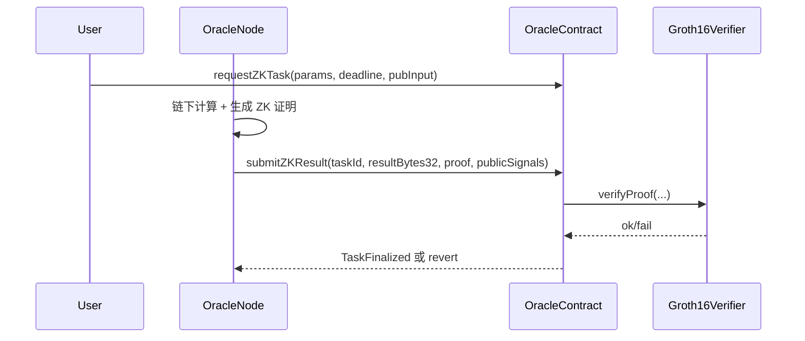

# 可信 Oracle：阈值签名与零知识证明的双层保障

本章讨论我们设计的 Oracle 方案，如何在链下计算场景中同时保证“参与者共识”（多数/阈值签名）与“计算正确性”（ZK 证明），并提供工程实现与实验要点。可直接纳入论文正文的某一章。

## 1. 设计动机
- 传统 Oracle 仅靠多签/投票，无法证明链下计算正确性；若节点作恶或计算错误，链上难以审计。
- 我们引入双层保障：**门限签名**保证“谁”认可结果，**Groth16 ZK 证明**保证“结果确实由指定算法计算”。两者合用，可同时抵御伪造签名与伪造计算。

## 2. 系统模型与接口（EVM/Fabric）
- **合约/链码接口（EVM）**：  
  - 任务创建：`requestTask(params, deadline)`；ZK 任务：`requestZKTask(params, deadline, publicInput)`  
  - 提交路径：`submitResult`（单签多数决）、`submitThresholdResult`（批量验签）、`submitZKResult`（Groth16 验证）  
  - 管理：`registerOracle/removeOracle`、`setMinResponses`、`setZKVerifier`
- **合约/链码接口（Fabric）**：  
  - 任务创建：`CreateTask`；提交：`SubmitResult`（逐个）/`SubmitThresholdResult`（批量验签）  
  - 管理：`RegisterOracle/DisableOracle`（公钥注册）
- **状态要点**：  
  - 任务记录 `finished/finalResult/deadline`，阈值响应计数（或去重 map）。  
  - ZK 模式记录 `zkMode` 与 `zkPublicInput`，绑定公开输入防止重放/替换。  
  - 已响应标记防重复提交，未注册节点拒绝，过期 deadline 拒绝。

## 3. 工作流程概览（时序）

## 4. 安全性分析（要点）
- **一致性**：只有签名数 ≥ `minResponses` 或 ZK 证明验证通过才写入状态。  
- **完整性**：已响应去重、防重复 signer、防未注册/过期提交。  
- **正确性（ZK）**：`publicSignals` 与链上登记的 `zkPublicInput` 绑定，伪造或篡改 proof 会被 `verifyProof` 拒绝。  
- **隐私**：链上仅存结果与承诺，链下可在 TEE/MPC 环境执行，不暴露原始数据。

## 5. 实验与评估要点
- **门限控制**：签名不足 vs 达标的状态变化（EVM/Fabric）；无效签名/重复 signer 需被拒绝。  
- **ZK 强制校验**：正确 proof 定案；篡改 proof/public/result 任一字段都应 revert。  
- **恶意与重放**：未注册节点、过期提交、重复提交均需失败。  
- **性能对比**：阈值路径 vs ZK 路径的 gas/耗时，吞吐/延迟曲线。  
- **可扩展实验**：恶意比例容忍度（f < minResponses）、Verifier 切换、生效/失效测试。

## 6. 实施与可复现资源（仓库路径）
- 合约/链码：`src/oracle-node/contracts/solidity/legacy/contract.sol`，`legacy/SimpleZKVerifier.sol`；`contracts/fabric/contract.go`。  
- 控制平面与监听：`oracle_node/backend/app.py`，`dashboard/`。  
- 实验脚本：`scripts/threshold_experiment.py`（阈值签名），`scripts/zk_submit_example.py`（ZK 提交）。  
- 实验方案：`docs/experiments/oracle_reliability.md`。  
- 设计说明：`docs/oracle_zk.md`。

## 7. 相关工作对比（简述）
- 多签/门限：MuSig2、FROST（低交互/抗恶意）；BLS 聚合（单签输出）。  
- ZK：Groth16（小验证成本）、Plonk/STARK（可信设置与通用性权衡）。  
- Oracle 网络：Chainlink/Band 依赖多节点投票但缺乏链下计算证明；本方案用双层验证补齐“计算正确性”缺口。
