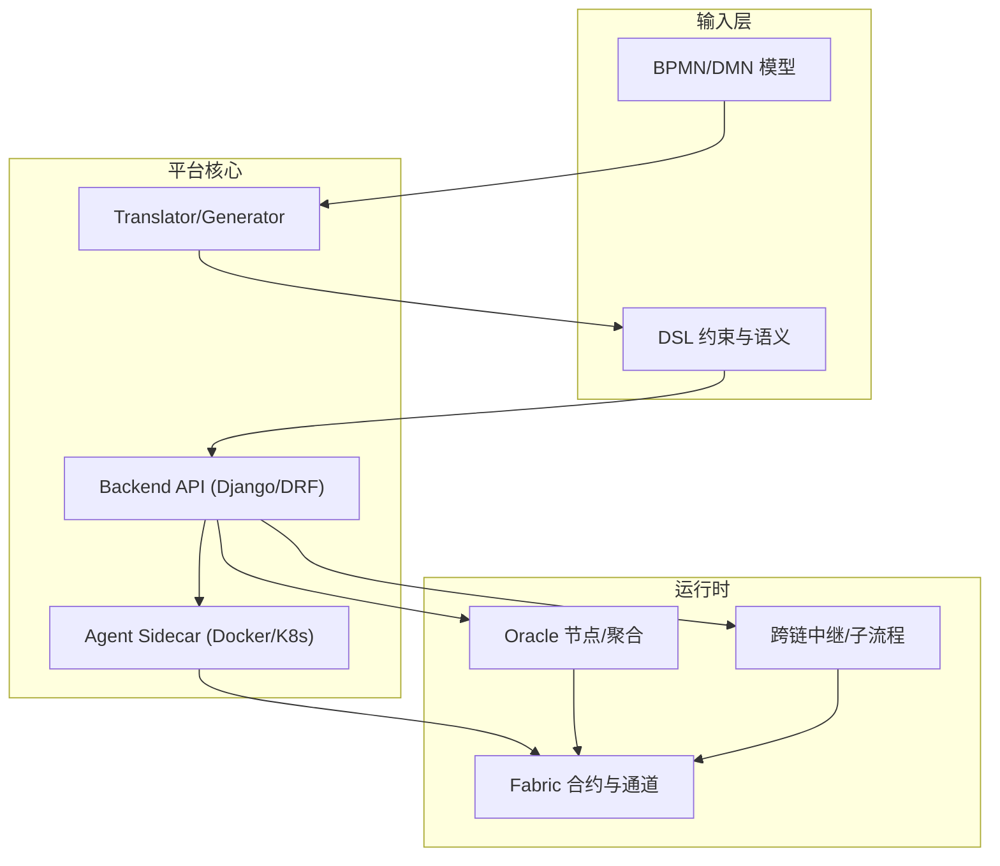
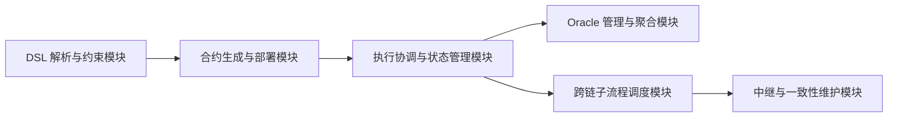
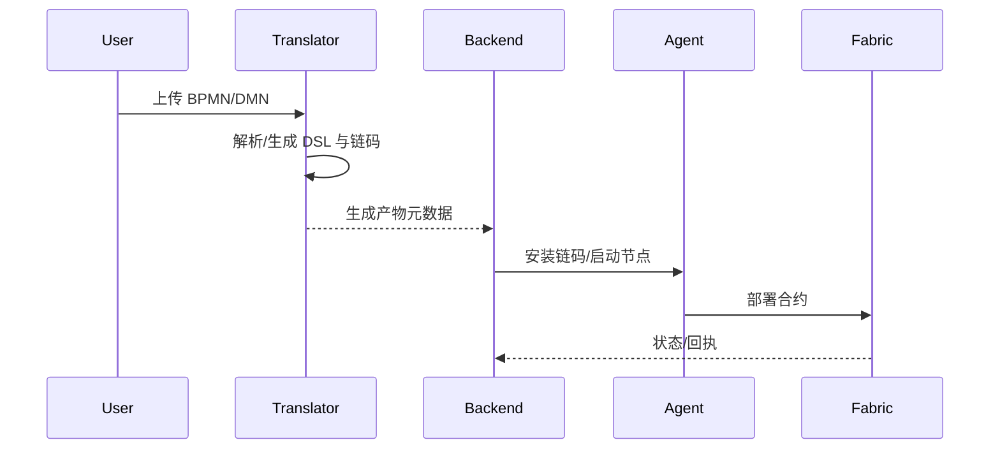
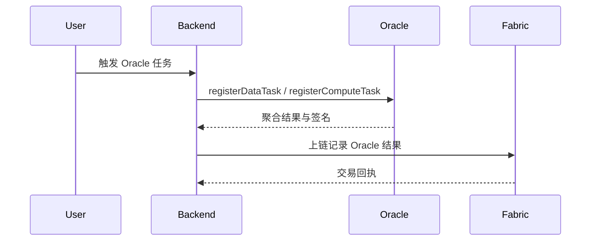
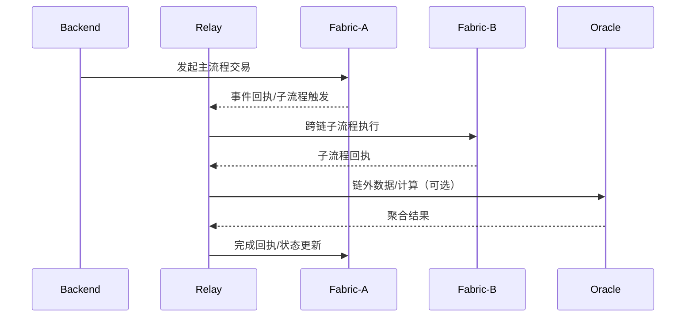
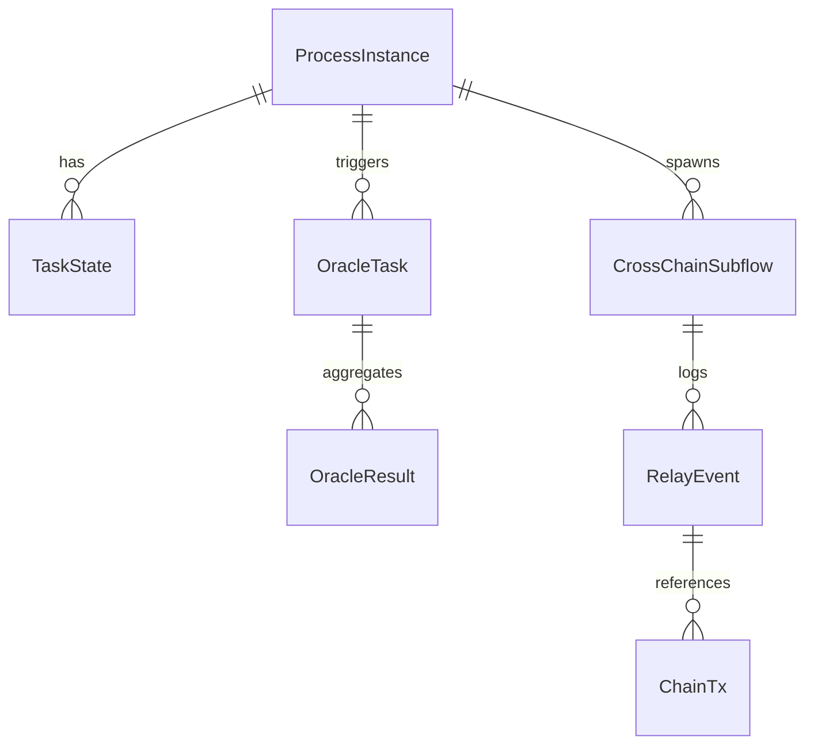

# 多方协作平台设计（整合 DSL / Oracle / 跨链中继）

> 本文档对应论文“多方协作平台设计”章节，聚焦于如何将 DSL 生成、Oracle 可信引入与跨链中继整合为可运行平台。内容基于 IBC 项目现有实现（Backend / NewTranslator / Agent / Oracle / 跨链组件）组织，突出工程落地点与运行期协同。

## 引言

本章从“平台整合视角”阐述 IBC 如何统一承载 DSL→合约生成、Oracle 服务与跨链中继三类能力，从而形成覆盖建模、部署、执行、审计的闭环平台。重点不在重新解释算法原理，而在于描述平台级组织方式、接口边界、运行期协同机制与可部署证据。章节结构遵循“需求→架构→模块→流程→数据/环境→案例→讨论”的逻辑，映射前三部分成果并给出实现落点。

## 系统需求分析

平台的整合需求强调“统一流程生命周期”。即：由 DSL 约束的业务流程能够驱动合约生成与部署；Oracle 引入的链外数据与计算结果必须保持一致性与可审计性；跨链子流程与中继必须在统一的运行态视图下协调执行。本节仅描述平台级需求，避免页面/CRUD层面的细节。

### 需求场景与假设

平台面向多组织协作场景，涉及多链并行与链外数据/计算参与，并明确支持 Fabric 联盟链与 ETH 私有链的并行编排。系统假设链上身份由许可链模型提供，组织之间通过联盟关系、资源集合与通道/命名空间实现权限隔离；跨链中继具备可达信道与回执机制，能够将子流程状态返回源链；Oracle 节点以“可配置的参与集合与阈值策略”方式组织，支持多源聚合并输出可验证的结果。系统输入包括 BPMN/DMN 模型、组织/联盟配置、跨链目标链与 Oracle 任务定义，输出为链上合约实例、链外任务结果上链记录与跨链执行回执。

### 功能性需求

平台能力按照“闭环链路”组织，从建模与导入开始，支持 BPMN/DMN 转换为 DSL，并保留可追溯的版本与约束信息；随后由 DSL 驱动链码/合约生成与部署，要求产物具备可索引的元数据，且能在 Fabric 与 ETH 私有链中一致执行。在运行期调度阶段，平台需要编排 Oracle 任务、接收聚合结果并上链，同时触发跨链子流程并通过中继完成回执同步，确保流程主链与目标链的状态保持一致。最后，系统必须提供统一的状态视图与审计能力，能以实例 ID、交易 ID 或任务 ID 追溯完整生命周期，从而形成可复现的工程证据链。

### 非功能性需求

平台的非功能目标与论文贡献强相关，核心在于可追溯、确定性与可验证性：流程实例、Oracle 任务与跨链事件必须具备稳定主键与序列化日志，以便复盘与审计；DSL 约束下的合约生成需可复核，链上执行结果可重放验证；Oracle 聚合结果与跨链回执需能够通过链上交易、元数据与日志进行交叉验证。同时，平台需具备基本容错能力，在节点/中继失败时能够重试或恢复，并支持组织规模与链数量扩展。上述指标应能通过吞吐/延迟、失败恢复时间与日志完备性等度量为案例与实验提供支撑。

## 系统设计

平台采用“前端多入口 + 后端编排 + Agent 执行 + 翻译服务 + Oracle/中继组件”的分层架构。DSL 与 Oracle 与跨链能力被设计为“流程生命周期内生能力”，贯穿从模型导入到运行期监控的全链路。

### 总体架构设计

下图展示 DSL 输入→生成→部署→执行的总体控制链路，以及 Oracle/中继的协同位置。

架构边界上，生成器负责 DSL 与合约产物；后端负责全局编排与状态视图；Agent 执行底层容器与资源调度；Oracle/中继为运行期一致性支撑组件，并通过统一接口与后端联动。

### 系统模块设计

模块划分以“论文成果落点”为中心，每个模块清晰定义职责与接口。

模块说明：  
- **DSL 解析与约束模块**：由 NewTranslator 解析 BPMN/DMN 并生成 DSL/产物，落点在 `newTranslator/generator`。  
- **合约生成与部署模块**：将 DSL 转为链码/合约并触发部署，落点在 Translator API 与 Backend 接口。  
- **执行协调与状态管理模块**：统一环境、节点、通道状态与任务实例，落点在 Backend 环境/资源路由。  
- **Oracle 管理与聚合模块**：注册 Oracle、聚合结果并上链，落点在 Oracle 组件与 Backend 交互。  
- **跨链子流程调度模块**：触发跨链子流程与回执收敛，落点在跨链路由与事件处理。  
- **中继与一致性维护模块**：确保跨链一致性边界，落点在 Relay 服务与链上回执。

### 系统流程设计

平台提供三条递进式运行流程，以展示能力叠加路径。

**流程 A：单链基线（DSL→合约→执行）**

**流程 B：单链 + Oracle（链外数据/计算参与）**

**流程 C：跨链子流程 + 中继（含 Oracle）**

### 系统数据库表（状态与元数据存储设计）

平台的数据设计以“统一状态视图”为目标：流程实例与任务状态、Oracle 任务与聚合记录、跨链子流程与中继事件必须可追溯并与链上交易关联。

关键表三线表（概念层）：

**表：process_instance**
| 字段 | 主键 | 类型 | 含义 |
| --- | --- | --- | --- |
| instance_id | 是 | UUID | 流程实例 ID |
| dsl_hash | 否 | bytes32 | DSL 版本/约束哈希 |
| status | 否 | enum | 运行状态 |
| chain_id | 否 | text | 关联链标识 |
| created_at | 否 | datetime | 创建时间 |

**表：oracle_task**
| 字段 | 主键 | 类型 | 含义 |
| --- | --- | --- | --- |
| oracle_task_id | 是 | UUID | Oracle 任务 ID |
| instance_id | 否 | UUID(FK) | 关联流程实例 |
| task_type | 否 | enum | data/compute |
| source_hash | 否 | bytes32 | 数据/计算来源 |
| threshold | 否 | int | 聚合阈值 |

**表：oracle_result**
| 字段 | 主键 | 类型 | 含义 |
| --- | --- | --- | --- |
| result_id | 是 | UUID | 聚合结果 ID |
| oracle_task_id | 否 | UUID(FK) | 关联 Oracle 任务 |
| value_hash | 否 | bytes32 | 结果哈希 |
| signer_set | 否 | json | 参与签名节点 |
| tx_id | 否 | text | 上链交易 ID |

**表：crosschain_subflow**
| 字段 | 主键 | 类型 | 含义 |
| --- | --- | --- | --- |
| subflow_id | 是 | UUID | 跨链子流程 ID |
| instance_id | 否 | UUID(FK) | 关联流程实例 |
| target_chain | 否 | text | 目标链 |
| relay_event_id | 否 | UUID(FK) | 中继事件引用 |

**表：relay_event**
| 字段 | 主键 | 类型 | 含义 |
| --- | --- | --- | --- |
| relay_event_id | 是 | UUID | 中继事件 ID |
| source_chain | 否 | text | 源链 |
| target_chain | 否 | text | 目标链 |
| tx_id | 否 | text | 相关交易 |
| status | 否 | enum | 发送/确认/超时 |

索引要点：以 `instance_id` 贯通流程视图，以 `tx_id` 与链上状态关联，以 `oracle_task_id` 和 `relay_event_id` 形成可追溯链路。

### 系统开发环境与运行环境

为了保证复现性，平台只强调与执行可信有关的环境要素：

| 组件 | 要求 | 说明 |
| --- | --- | --- |
| Fabric | 2.2+ | 多组织/通道隔离 |
| Oracle | 多节点 | 支持聚合与阈值 |
| Relay | 可达信道 | 跨链事件转发 |
| Backend | Django/DRF | 统一编排 |
| Translator | FastAPI | DSL/链码生成 |
| Agent | Docker/K8s | 运行期调度 |

最小可复现实验配置示例：  
- 组织数：2；联盟数：1  
- 链数：2（链 A / 链 B）  
- Oracle 节点数：3（满足阈值聚合）  
- 中继实例：1  

### 系统运行案例展示

选取一个“最小但完整”的协作案例：  
**“多组织协作的租赁流程”**：  
1) 业务方通过 BPMN/DMN 输入流程与决策规则；  
2) DSL 解析生成链码，部署在链 A；  
3) Oracle 拉取外部信用分并聚合；  
4) 链 A 触发跨链子流程至链 B 处理支付；  
5) 中继将回执返回链 A，完成主流程。  

证据链展示格式（示例）：  
- **DSL 片段**：关键约束/子流程声明  
- **合约产物摘要**：链码/接口清单  
- **运行日志片段**：Oracle 聚合与跨链回执  
- **链上状态变更**：`instance_id` 与 `tx_id` 可追溯  

### 研究对比与讨论

对比维度以系统能力为主：  
1) 是否统一建模与生成（DSL 驱动）  
2) 是否具备 Oracle 可信引入与聚合  
3) 是否支持跨链子流程与一致性维护  
4) 是否形成可部署、可追溯的闭环平台  

平台限制主要来自：跨链延迟与中继失败模式、Oracle 节点规模效应与一致性代价、链上资源消耗与部署成本。可扩展方向包括：多中继并行、Oracle 节点自治与信誉引导、跨链一致性协议升级等。  

### 小结

本章给出了一个统一承载 DSL、Oracle 与跨链能力的可运行平台设计；通过架构、模块与流程描述展示了三类能力在同一生命周期内协同的工程落点；同时指出了可复现部署与能力边界，为后续实验与讨论提供基础。
