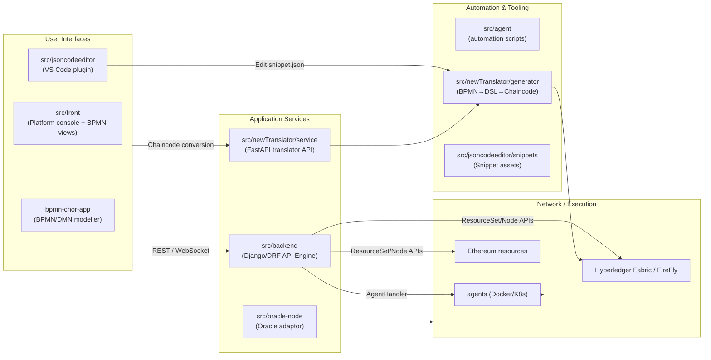

# IBC System Architecture

This document captures the high‑level architecture of the IBC workspace together with the major repositories/modules inside the `system/` directory. It complements the more detailed backend notes in `docs/backend_overview.md`.

## 1. Solution Overview



* **User Interfaces** – the BPMN choreographer (`bpmn-chor-app`), the main web front-end (`src/front`), and the VS Code extension (renamed SnippetSmith).
* **Application Services** – the Django backend orchestrates environments, nodes, agents, identity, BPMN/DMN flows; the FastAPI translator focuses on BPMN→chaincode pipelines.
* **Automation & Tooling** – helper scripts for agent lifecycle, the chaincode generators, snippet templates, and the translator dashboard.
* **Runtime** – Docker/Kubernetes agents plus Fabric/Ethereum resources that the backend provisions.

## 2. Key Components

| Module | Location | Responsibility | Notes |
| --- | --- | --- | --- |
| **Backend API Engine** | `src/backend` | Django/DRF API surface for environments, agents, nodes, CA, chaincode, BPMN, Firefly, etc. | Router defined in `api_engine/urls.py`. See `docs/backend_overview.md`. |
| **Front-end Portal** | `src/front` | Operator portal (Vue/React + Antd) covering BPMN, translation flows, resource management. | Coordinates with backend via REST. |
| **Choreography Modeler** | `bpmn-chor-app` | Standalone BPMN/DMN editor (React) for IBC process definitions. | Output consumed by translator/portal. |
| **Translator (generator / service / dashboard)** | `src/newTranslator` | `generator/` does BPMN parsing and DSL/chaincode generation; `service/` exposes FastAPI endpoints; `dashboard/` is the Material×AWS Vite UI. | Python virtual env + Node build artifacts. |
| **Agent automation scripts** | `src/agent`, `src/backend/api/services/agent.py` | Helper utilities around agent lifecycle and container orchestration. | Django `AgentService` wraps Docker/K8s implementations. |
| **SnippetSmith VS Code plugin** | `src/jsoncodeeditor` | `extension.js` now structures code lenses, tree view, and snippet editing; packaged as `snippetsmith-0.0.1.vsix`. | Supports editing `snippet.json` with inline actions. |
| **Oracle adaptor** | `src/oracle-node` | Off-chain oracle node provisioning logic. | Works with blockchain runtime. |
| **Py Translator / Legacy scripts** | `src/py_translator`, `src/newTranslator/DSL`, etc. | Legacy translation helpers and DSL definitions. | Referenced by CLI commands in `newtranslator_env.sh`. |

## 3. File/Directory Organization (Top Level)

```
system/
├── bpmn-chor-app/           # BPMN/DMN editor (React)
├── docs/                    # Architecture docs (this file, backend_overview, etc.)
├── src/
│   ├── backend/             # Django API engine
│   ├── front/               # Web portal
│   ├── agent/               # Automation scripts & helpers
│   ├── jsoncodeeditor/      # SnippetSmith VS Code extension
│   ├── newTranslator/       # Translator (generator + service + dashboard)
│   ├── oracle-node/         # Oracle integration
│   ├── py_translator/       # Legacy translator utilities
│   └── requirements.txt     # Shared Python deps
├── logs/, traces/           # Runtime telemetry
└── Experiment/, Readme*.md  # Guides and experimental assets
```

### Backend (`src/backend`)
- `api/` – DRF apps, models, routes, tasks, utilities.
- `api/lib/agent` & `api/services/agent.py` – Docker/K8s agent implementations and service layer.
- `api/routes/*` – viewsets for nodes, agents, environments, chaincode, BPMN/DMN, Firefly, etc.
- `api_engine/` – Django project scaffolding (`settings`, `urls`, `wsgi`, Celery config).
- `opt/`, `pgdata/` – packaged binaries, config, and database artifacts for development.

### Translator (`src/newTranslator`)
- `generator/` – BPMN/DMN parser, DSL builders, snippets, resources, CLI (`bpmn_to_dsl.py`).
- `service/` – FastAPI server bridging REST to generator.
- `dashboard/` – Vite React UI to upload BPMN/DMN and preview outputs.
- `CodeGenerator/`, `DSL/` – textX definitions and template targets for Go/Solidity.
- `newtranslator_env.sh` – CLI entry points (`nt-go-gen`, `nt-bpmn-to-b2c`, etc.).

### VS Code Extension (`src/jsoncodeeditor`)
- `extension.js` – entrypoint with CodeLens, TreeView, and snippet file editing logic.
- `package.json` – contribution points, commands, and metadata for SnippetSmith.
- `assets/`, `test/`, `jsoncodeeditor-0.0.1.vsix` – icons, scaffolding, packaged builds.

## 4. Recommended Navigation

1. **Start with `docs/backend_overview.md` and this file** to understand high-level flows.
2. **Backend** – explore `src/backend/api/routes` (entry points) and `api/models.py` (data model) before diving into Celery tasks / agents.
3. **Translator** – follow `generator/translator.py` → `service/api.py` → `dashboard/src/components/TranslatorWorkbench.tsx`.
4. **Front-end** – inspect `src/front/src/views/BPMN` for how BPMN/DMN editors integrate with backend.
5. **Extensions & Tooling** – look at `src/jsoncodeeditor/extension.js` for snippet editing and `src/newTranslator/newtranslator_env.sh` for CLI workflows.

Keeping this mental map makes it easier to reason about cross-module interactions (e.g., BPMN definitions flowing from `bpmn-chor-app` → frontend → backend → translator → agent containers).
