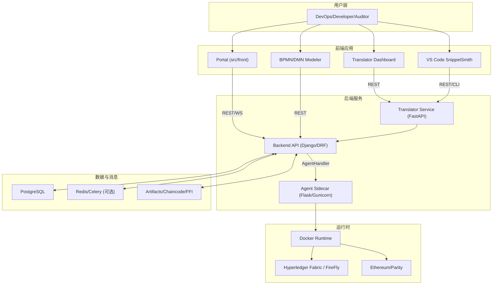
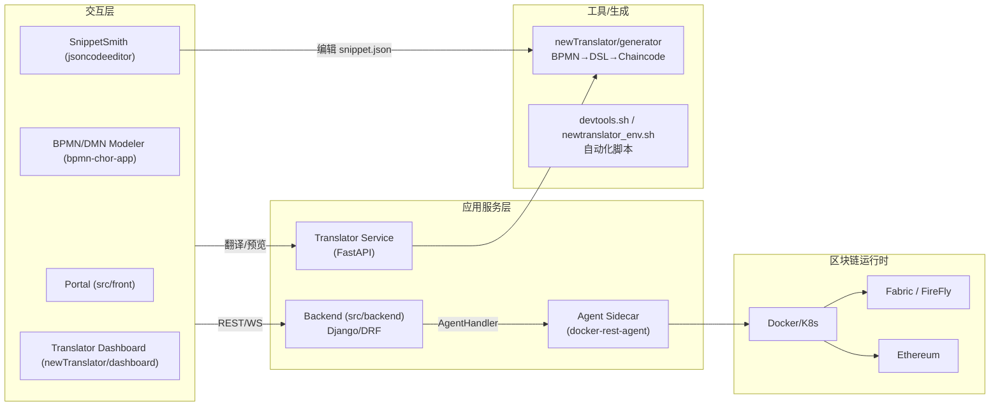
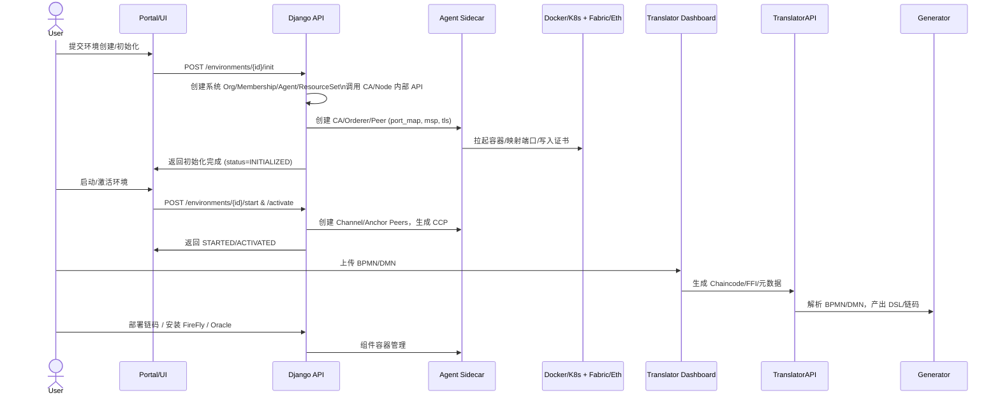
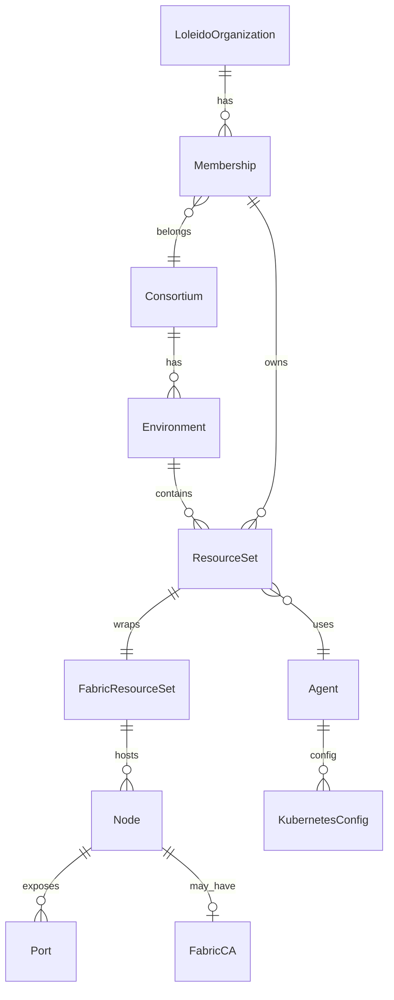

# IBC 系统设计与实现（Backend / NewTranslator / Agent）

> 本文面向论文章节撰写，涵盖需求分析、整体设计、模块设计、流程设计、数据模型与环境说明。示例图使用 Mermaid，可在生成 PDF 前用 `mmdc` 或 VS Code 渲染。

## 1 系统需求分析

### 1.1 业务需求
- 支持多组织、多联盟的区块链环境自动化部署与运维（Hyperledger Fabric / 以太坊）。
- BPMN/DMN 业务流程模型的在线编排、协同与链码（Chaincode/FFI）自动生成。
- 提供 Oracle、FireFly、DMN 引擎等可插拔组件的安装与启动。
- 通过统一的 API/前端门户/VS Code 插件，支撑开发者与运维人员的全链路操作。

### 1.2 功能需求
- **环境管理**：创建/初始化/启动/激活区块链环境，管理组织、节点、通道、证书。
- **翻译服务**：将 BPMN/DMN 转换为链码与 FFI，支持可视化上传、接口调用与 CLI。
- **Agent 调度**：对接 Docker/K8s 侧的 Agent，完成容器创建、端口映射、证书交付。
- **组件接入**：安装/启动 FireFly、Oracle、DMN Engine；注册接口与 FFI。
- **多端入口**：前端 Portal、独立 BPMN/DMN Modeler、VS Code 插件（SnippetSmith）与 CLI。

### 1.3 非功能需求
- 自动化与幂等：初始化/启动流程可重复执行，失败可回滚或重试。
- 可观测性：Agent/后端请求日志、结构化错误提示。
- 安全性：基于 JWT 的鉴权、组织/环境级别的资源隔离。
- 可扩展性：模块化的 AgentFactory（Docker/K8s）、可替换的翻译后端（FastAPI）。

### 1.4 典型用例与用例图
- DevOps：创建联盟/组织 → 初始化/启动/激活区块链环境 → 安装 FireFly/Oracle/DMN。
- 开发者：使用 Translator 将 BPMN/DMN 生成链码/FFI → 在后端部署链码 → 通过 Portal/CLI 调试。
- 审计/合规：查看环境状态、节点清单、日志与接口注册记录。
- 集成方：调用 Platform API/Resource API 以自动化 CI/CD 流程。

```mermaid
usecaseDiagram
    actor DevOps as "DevOps"
    actor Developer as "开发者"
    actor Auditor as "审计"
    actor Integrator as "集成方/CI"

    DevOps --> (创建/初始化环境)
    DevOps --> (启动/激活环境)
    DevOps --> (安装可插拔组件 FireFly/Oracle/DMN)

    Developer --> (BPMN/DMN → 链码/FFI 翻译)
    Developer --> (部署链码与接口注册)
    Developer --> (前端/插件调试)

    Auditor --> (查看环境/节点状态)
    Auditor --> (查看日志与注册记录)

    Integrator --> (调用 Platform/Resource API 自动化)
```

## 2 系统设计

### 2.1 系统结构（容器/部署视图）



### 2.2 系统模块设计



### 2.3 系统流程设计（高层时序）



### 2.4 数据库表设计（ER 概要）

> 简化版，核心实体与关系；完整模型见 `api/models.py` / `er.png`。



表要点：
- ResourceSet 与 FabricResourceSet 1:1，区分用户/系统组织。
- Node 依附 ResourceSet/Agent，并维护端口映射 (Port) 与链码/证书文件。
- Agent 抽象宿主，类型 docker/kubernetes，可附带 K8s 配置。

#### 2.4.1 主要表结构（概要）

| 表 | 主键 | 关键字段 | 类型 | 含义 |
| --- | --- | --- | --- | --- |
| consortium | id | name, description | UUID, text | 联盟定义 |
| organization | id | name, domain | UUID, text | 组织主体 |
| membership | id | organization_id(FK), consortium_id(FK), role | UUID, UUID, text | 组织-联盟关系 |
| environment | id | consortium_id(FK), name, type(fabric/eth), status | UUID, UUID, text, enum | 运行环境 |
| agent | id | name, host, type(docker/k8s), organization_id(FK) | UUID, text, text, UUID? | 宿主代理配置 |
| resourceset | id | membership_id(FK), environment_id(FK), role | UUID, UUID, text | 资源集合抽象 |
| fabricresourceset | id | resource_set_id(1:1), system_org(bool) | UUID, UUID, bool | Fabric 资源集合具体化 |
| node | id | resource_set_id(FK), agent_id(FK), name, type(peer/orderer/ca), status | UUID, UUID, text, enum, text | 节点定义 |
| port | id | node_id(FK), internal, external | UUID, UUID, int, int | 端口映射（唯一 internal+external+node） |
| fabricca | id | node_id(FK), csr_host, tls_cert_path | UUID, UUID, text | CA 节点补充信息 |
| kubernetesconfig | id | agent_id(FK), kubeconfig | UUID, UUID, text | Agent 的 K8s 配置 |
| chaincode | id | environment_id(FK), name, version, language, package_path | UUID, UUID, text | 链码元数据 |
| ffi_interface | id | environment_id(FK), name, url, schema | UUID, UUID, text | Oracle/FFI 注册信息 |
| tasklog | id | module, ref_id, status, payload | UUID, text, UUID, json | 任务/调用日志 |

### 2.5 开发与运行环境

| 组件 | 版本/要求 | 说明 |
| --- | --- | --- |
| Python | 3.10+ | Django/DRF 后端、Agent 脚本 |
| Node | 18+ | 前端、Modeler、Dashboard |
| Docker | 20+ | 运行 Agent 管理的容器 |
| Postgres | 13+ | Backend 数据库 |
| Redis | 6+ | Celery Broker（可选） |
| Fabric | 2.2+ | 链码与网络运行时 |
| 其他 | jq, mmdc | 文档/图渲染（Mermaid） |

运行方式示例：
- 后端：`cd src/backend && source venv/bin/activate && python manage.py runserver`
- Agent：`cd src/agent/docker-rest-agent && python3 -m venv .venv && source .venv/bin/activate && pip install -r requirements.txt && gunicorn server:app -c gunicorn.conf.py`
- Translator API：`cd src/newTranslator/service && uvicorn api:app --reload --port 9999`
- 前端 Portal：`cd src/front && npm install && npm run dev -- --host`
- BPMN Modeler：`cd bpmn-chor-app && npm install && npm run dev`
- VS Code 插件：`src/jsoncodeeditor/snippetsmith-0.0.1.vsix` 安装后提供 snippet 编辑。

## 3 系统实现细节

### 3.1 后端（Django/DRF）
- 路由：`api_engine/urls.py` 注册 Environment/ResourceSet/Node/CA/Chaincode/FireFly/BPMN/DMN 等 ViewSet。
- Agent 适配：`api/services/agent.py` + `api/lib/agent/*`（DockerAgent/KubernetesAgent），统一生命周期接口（create/start/stop/update_config）。
- 环境流水线：`api/routes/environment/views.py` 的 init/start/activate 完成系统 Org/CA/Orderer/Peer 创建、通道与 Anchor 配置。
- 数据一致性：新增 OneToOne ResourceSet↔FabricResourceSet、Port 唯一约束、Agent on_delete SET_NULL 等。

### 3.2 Translator（FastAPI + Generator）
- Generator：`newTranslator/generator/translator.py` 解析 BPMN/DMN，产出 DSL/Chaincode/FFI；提供 CLI（`bpmn_to_dsl.py`）和 Python API。
- Service：`newTranslator/service/api.py` 将翻译能力通过 REST 暴露。
- Dashboard：`newTranslator/dashboard` Material × AWS 风格工作台，支持 BPMN/DMN 上传、链码/FFI 预览、元数据洞察。

### 3.3 Agent（Flask/gunicorn）
- REST API：`/api/v1/ca`, `/api/v1/nodes`, `/api/v1/ethnode`, `/api/v1/ports` 等；请求/响应全量日志在 `server.py` 的 before/after 中输出。
- 模板：`app/template_lib/fabric.py` / `ethereum.py` / `ipfs.py` 负责容器 spec 拼装；`utils.parse_port_map` 校验端口映射。
- 响应结构：统一 `{res: {code, data, msg}}`。

### 3.4 VS Code 插件（SnippetSmith）
- 文件：`src/jsoncodeeditor/extension.js`，提供 snippet.json 的 CodeLens（Edit/Delete/QuickPick）、TreeView 与临时文件编辑。
- 打包：`npx vsce package` 生成 `snippetsmith-0.0.1.vsix`。

### 3.5 devtools 与自动化
- `src/devtools.sh`：一键启动/清理/导出 ER/启动前端或 Agent，兼容 `.venv`/`venv` 检测。
- `newtranslator_env.sh`：翻译相关 CLI（nt-bpmn-to-b2c、nt-go-gen 等）。

## 4 关键流程（示例）

### 4.1 环境初始化（Fabric）
1. `POST /environments/{id}/init`：创建系统 Org/Membership/Agent/ResourceSet/FabricResourceSet，调用 CA/Node API。
2. Agent 创建 CA/Orderer/Peer 容器，写入证书与端口映射。
3. 状态置为 INITIALIZED。

### 4.2 环境启动/激活
1. `POST /environments/{id}/start`：创建网络、更新状态 STARTED。
2. `POST /environments/{id}/activate`：收集 orderer/peer 列表 → 创建通道 → 生成 AnchorPeers/CCP → 状态 ACT

### 4.3 BPMN → Chaincode
1. 前端/插件上传 BPMN/DMN 至 Translator API。
2. Generator 解析并生成 DSL/Chaincode/FFI。
3. 用户在 Backend 部署链码或触发 Oracle/FireFly 注册。

## 5 设计取舍与优化

- **接口幂等**：环境 init/start/activate 多为重复调用，需结合 DB 状态与 Agent 返回值做防重。
- **错误处理**：对 Agent 返回格式（res.data.id）兼容；日志记录请求/响应体以便追踪。
- **数据约束**：Port 唯一、ResourceSet 唯一组合、Agent/Node 关联 SET_NULL，防止级联误删。
- **安全**：仅示例使用 `DEBUG=True` / 默认密钥，生产需配置 `.env`，加固 JWT/CSRF。
- **观测性**：Agent/Backend 增加 INFO/ERROR 日志；可接入 Prometheus/Grafana 进行容器与链路监控。

## 6 B2C DSL 语法与 FSM 映射

### 6.1 语法构成（概要）
- **核心元素**：`participant`、`message`、`business_rule`、`start event`/`end event`、`gateway`（`exclusive`、`event`、`parallel` 两种：split/merge）、`state memory`（全局变量）。
- **流程单元**：`flow` 由动作语句组成，语句包含三类：`enable/disable` 元素，`set <global> = <literal>` 写入状态，`await`（并行合并）或 `choose`（条件选择）。
- **条件表达式**：支持布尔表达式与字面量比较（`==`, `!=`, `>`, `<`, `>=`, `<=`，同时支持括号与逻辑运算符 `&&`, `||`, `!`）。表达式可引用全局变量、消息字段、业务规则输出。
- **并行语义**：`parallel gateway <id> await a, b, ... then <actions>;` 表示所有前置分支完成后才能触发后续动作；在链码中体现为多条件守卫。
- **事件/互斥网关**：`choose { if <cond> then <actions>; ... else <actions>; }` 对应 BPMN 条件流；事件网关采用“先到先得”并关闭其他分支。
- **初始化与实例**：`init` 块创建参与者/消息/规则/网关并设置初始状态；`state memory` 定义所有全局变量并在链码中生成结构体字段。

### 6.2 FSM 视角的形式化
- **状态空间**：每个流程元素维护离散状态集 `DISABLED | ENABLED | WAITING | COMPLETED`（ElementState），全局状态为各元素状态与 `StateMemory` 的直积，形成有限状态机。
- **初始状态**：`init` 定义的 StartEvent 为 ENABLED，其他元素 DISABLED；`StateMemory` 使用 DSL 字面量或推断默认值初始化。
- **转移函数**：每条 DSL 语句对应一个转移：
  - `enable x`：在守卫条件满足时将元素 x 的状态置为 ENABLED。
  - `disable x`：将元素标记为不可再执行。
  - `set g = v`：对 `StateMemory` 进行赋值，扩展了 FSM 的状态维度。
  - `await a, b then ...`：转移前检查所有前置元素状态为 COMPLETED；否则保持原状态（拒绝转移）。
  - `choose/if`：转移受布尔表达式守卫；对事件网关，首个触发分支完成后会通过禁用其他分支实现互斥。
- **守卫与变量绑定**：BPMN 中的条件表达式与 SequenceFlow 名称被解析为布尔守卫，所涉及的变量被加入 `StateMemory`。业务规则与消息输入也会自动生成对应的全局变量并在链码中读写。
- **并发与合流**：Parallel Gateway 的转移只有在所有前置元素 COMPLETED 时才触发，满足多输入合流的同步条件，保证 FSM 的合取同步。
- **终止与可达性**：EndEvent 被完成（COMPLETED）即表示实例终止；生成器保持拓扑顺序与守卫条件，确保不可达路径在 FSM 中被剪枝（禁用）。

### 6.3 链码级实现映射
- **Go/Solidity 结构体**：`ContractInstance` 中保存元素状态映射与 `StateMemory` 结构；布尔/数字/字符串类型从 DSL 字面量推断并生成字段。
- **执行入口**：每个元素对应一个链码方法（消息 send/complete、规则 continue、网关入口等）。方法内部先检查 ENABLED，再验证守卫条件，通过转移函数更新状态并持久化。
- **幂等性与拒绝**：若守卫不满足或状态非法，方法返回错误，不更新世界状态；从 FSM 角度看为“拒绝转移”。
- **并行/事件网关**：并行合流在链码中显式检查全部前置 COMPLETED；事件网关在某分支完成后禁用其他分支并继续后续动作，保持互斥。
- **确定性**：转移只依赖当前状态与守卫表达式值，无外部随机性；满足 Fabric/以太坊的确定性要求。

## 7 结论

本系统通过 Django 后端、FastAPI 翻译服务、Agent Sidecar、前端/插件多入口的组合，实现了多联盟区块链环境的“建、启、用”一站式自动化，以及 BPMN/DMN 到链码的生成与部署。模块化设计（AgentFactory、Translator generator/service/dashboard、devtools）使得扩展到新运行时或新前端形态更为容易，为多组织协同场景提供可落地的基础设施与工具链。
