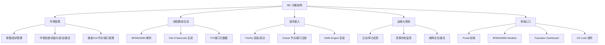
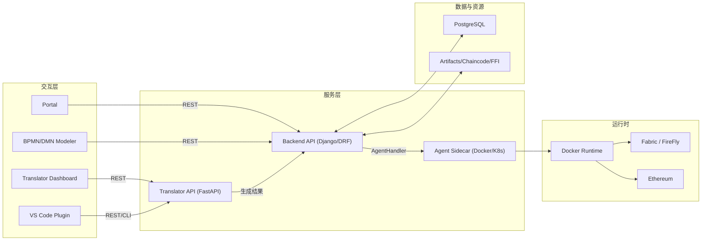
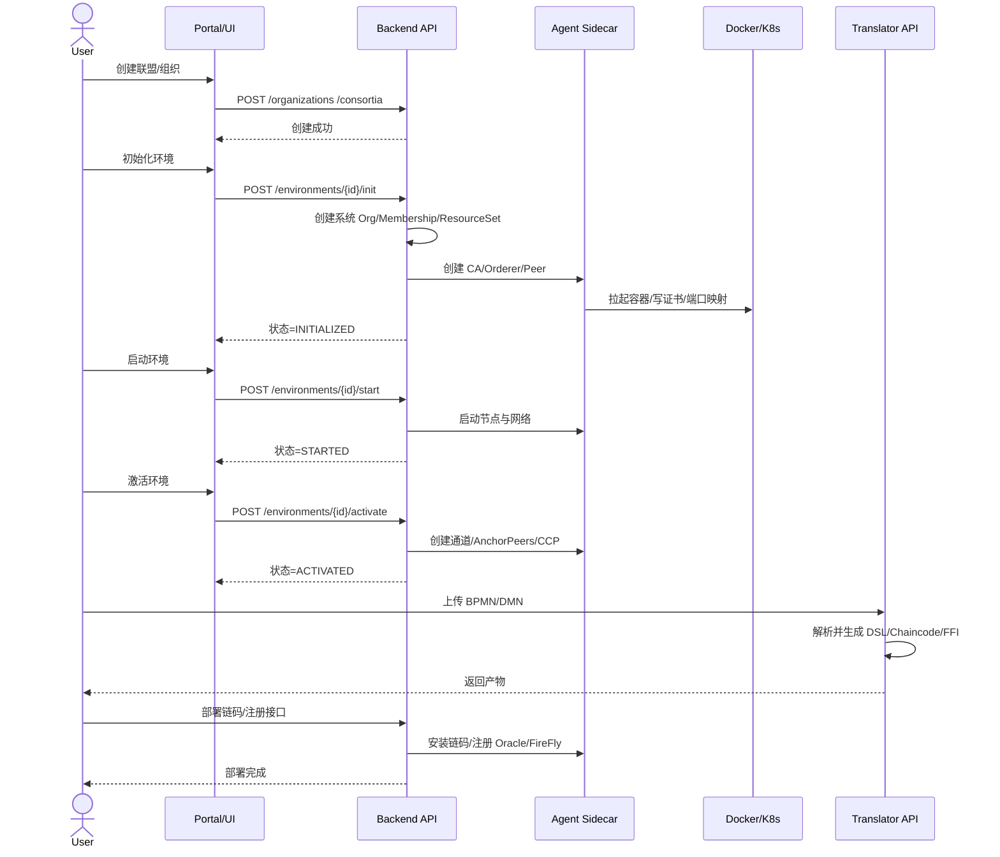
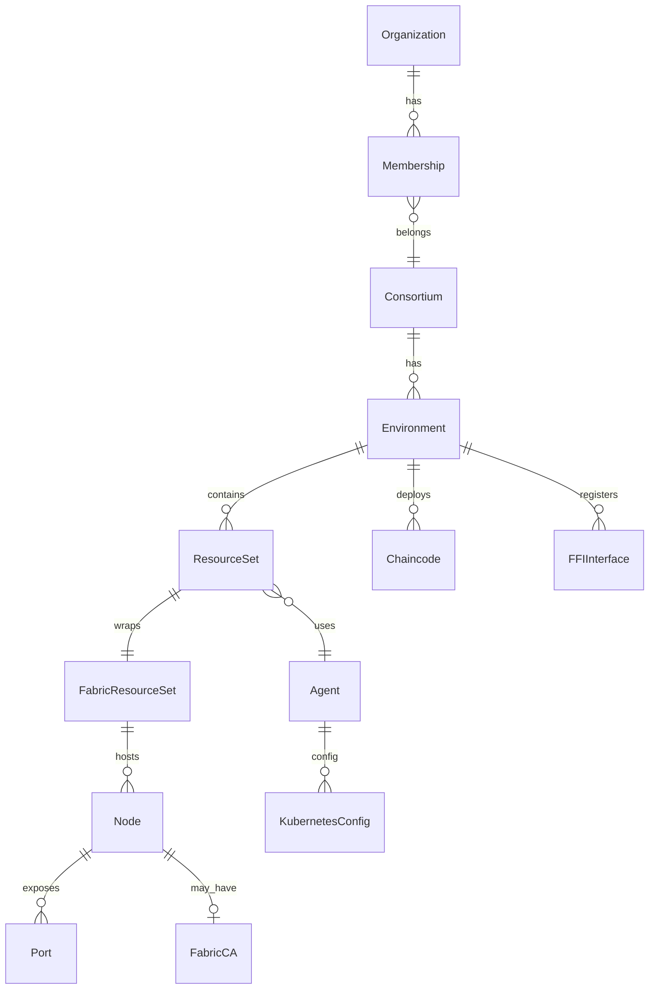

# IBC 系统需求分析与设计文档（Backend / NewTranslator / Agent）

> 面向论文撰写的系统需求与设计章节草稿。所有图以 Mermaid 给出，便于后续转为 PDF。

## 1 系统需求分析

### 1.1 需求分析（用例图）

业务目标是为多组织区块链协作场景提供“环境构建 + 流程翻译 + 组件编排”的一体化平台。
核心角色包括 DevOps、开发者、审计与集成方（CI/第三方系统）。

```mermaid
usecaseDiagram
    actor DevOps as "DevOps"
    actor Developer as "开发者"
    actor Auditor as "审计/监管"
    actor Integrator as "集成方/CI"

    DevOps --> (创建联盟/组织)
    DevOps --> (创建/初始化环境)
    DevOps --> (启动/激活环境)
    DevOps --> (安装 FireFly/Oracle/DMN)
    DevOps --> (扩容/缩容节点)

    Developer --> (BPMN/DMN 翻译)
    Developer --> (生成链码/FFI)
    Developer --> (部署链码与接口)
    Developer --> (前端/插件调试)

    Auditor --> (查询环境状态)
    Auditor --> (查询接口注册记录)
    Auditor --> (审计日志追溯)

    Integrator --> (调用平台 API 自动化)
    Integrator --> (注册外部服务/Oracle)
```

### 1.2 非功能需求分析

- **可用性**：环境初始化/启动具备幂等特性；失败可重试或回滚，保证流程可恢复。
- **可靠性**：Agent 与后端采用明确的请求/响应规范；对外部容器运行状态进行健康检测。
- **可观测性**：后端、Agent 记录请求/响应与错误上下文；关键流程可追溯。
- **安全性**：组织/联盟级隔离；敏感信息（证书、密钥）不在前端直接暴露。
- **扩展性**：AgentFactory 支持 Docker/K8s；翻译服务支持新增 DSL/链码模板。
- **可维护性**：模块边界清晰（Backend / Agent / Translator）；接口职责明确。
- **性能**：批量节点创建、证书分发、链码生成等任务应支持并发与异步优化。

### 1.3 功能结构图（按需求拆分模块）

将需求拆分为环境管理、翻译生成、组件接入、运维观测与多端入口五大功能域。



## 2 系统设计

### 2.1 系统模块设计（模块图与协作）

系统采用“前端多入口 + 后端编排 + Agent 侧执行 + 翻译服务”的分层架构。
模块之间通过 REST/HTTP 与内部服务调用协作。



### 2.2 系统流程设计（运行时完整时序）

以 Fabric 环境初始化 → 启动 → 激活为主线，同时串联翻译与组件接入流程。



### 2.3 系统数据库表设计

#### 2.3.1 ER 图（概要）



#### 2.3.2 关键表三线表（字段/主键/类型/含义）

> 采用论文常用三线表格式表达。字段类型为概念层类型，具体与 ORM 细节略有差异。

**表：organization**
| 字段 | 主键 | 类型 | 含义 |
| --- | --- | --- | --- |
| id | 是 | UUID | 组织唯一标识 |
| name | 否 | text | 组织名称 |
| domain | 否 | text | 组织域名/命名空间 |
| created_at | 否 | datetime | 创建时间 |

**表：consortium**
| 字段 | 主键 | 类型 | 含义 |
| --- | --- | --- | --- |
| id | 是 | UUID | 联盟唯一标识 |
| name | 否 | text | 联盟名称 |
| description | 否 | text | 描述 |
| created_at | 否 | datetime | 创建时间 |

**表：membership**
| 字段 | 主键 | 类型 | 含义 |
| --- | --- | --- | --- |
| id | 是 | UUID | 成员关系 ID |
| organization_id | 否 | UUID(FK) | 组织外键 |
| consortium_id | 否 | UUID(FK) | 联盟外键 |
| role | 否 | text | 成员角色（owner/member） |

**表：environment**
| 字段 | 主键 | 类型 | 含义 |
| --- | --- | --- | --- |
| id | 是 | UUID | 环境唯一标识 |
| consortium_id | 否 | UUID(FK) | 联盟外键 |
| name | 否 | text | 环境名称 |
| type | 否 | enum | fabric / eth |
| status | 否 | enum | initialized/started/activated |
| created_at | 否 | datetime | 创建时间 |

**表：agent**
| 字段 | 主键 | 类型 | 含义 |
| --- | --- | --- | --- |
| id | 是 | UUID | Agent ID |
| name | 否 | text | Agent 名称 |
| host | 否 | text | Agent Host |
| type | 否 | enum | docker / k8s |
| organization_id | 否 | UUID(FK) | 归属组织 |

**表：resourceset**
| 字段 | 主键 | 类型 | 含义 |
| --- | --- | --- | --- |
| id | 是 | UUID | 资源集合 ID |
| membership_id | 否 | UUID(FK) | 成员关系外键 |
| environment_id | 否 | UUID(FK) | 环境外键 |
| role | 否 | text | 资源集合角色（system/user） |

**表：fabricresourceset**
| 字段 | 主键 | 类型 | 含义 |
| --- | --- | --- | --- |
| id | 是 | UUID | Fabric 资源集合 ID |
| resource_set_id | 否 | UUID(1:1) | ResourceSet 外键 |
| system_org | 否 | bool | 是否系统组织 |

**表：node**
| 字段 | 主键 | 类型 | 含义 |
| --- | --- | --- | --- |
| id | 是 | UUID | 节点 ID |
| resource_set_id | 否 | UUID(FK) | 资源集合外键 |
| agent_id | 否 | UUID(FK) | Agent 外键 |
| name | 否 | text | 节点名称 |
| type | 否 | enum | peer/orderer/ca |
| status | 否 | text | 节点状态 |

**表：port**
| 字段 | 主键 | 类型 | 含义 |
| --- | --- | --- | --- |
| id | 是 | UUID | 端口映射 ID |
| node_id | 否 | UUID(FK) | 节点外键 |
| internal | 否 | int | 容器端口 |
| external | 否 | int | 宿主端口 |

**表：chaincode**
| 字段 | 主键 | 类型 | 含义 |
| --- | --- | --- | --- |
| id | 是 | UUID | 链码 ID |
| environment_id | 否 | UUID(FK) | 环境外键 |
| name | 否 | text | 链码名称 |
| version | 否 | text | 版本 |
| language | 否 | text | 语言 |
| package_path | 否 | text | 包路径 |

**表：ffi_interface**
| 字段 | 主键 | 类型 | 含义 |
| --- | --- | --- | --- |
| id | 是 | UUID | 接口 ID |
| environment_id | 否 | UUID(FK) | 环境外键 |
| name | 否 | text | 接口名称 |
| url | 否 | text | 接口地址 |
| schema | 否 | json | 接口 schema |

### 2.4 系统开发环境和运行环境

| 组件 | 版本/要求 | 说明 |
| --- | --- | --- |
| Python | 3.10+ | Django/DRF 后端与 Agent |
| Node | 18+ | 前端/Modeler/Dashboard |
| Docker | 20+ | 容器运行时 |
| Postgres | 13+ | 数据库 |
| Redis | 6+ | 异步/缓存（可选） |
| Fabric | 2.2+ | Fabric 运行时 |
| 工具链 | mmdc, jq | 文档与脚本辅助 |

运行示例：
- Backend：`cd src/backend && source .venv/bin/activate && python manage.py runserver`
- Agent：`cd src/agent/docker-rest-agent && source .venv/bin/activate && gunicorn server:app -c gunicorn.conf.py`
- Translator：`cd src/newTranslator/service && uvicorn api:app --reload --port 9999`
- Portal：`cd src/front && npm install && npm run dev -- --host`
