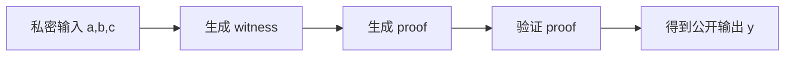

# ZK 计算确定性证明 Demo（本地，无区块链）

本 Demo 证明：存在私密输入 `a,b,c`，使得 `y = a * b + c`。  
验证者只看到 `y`，但仍能验证计算结果正确性。  

## 文件说明

- `circuit.circom`：Circom 电路定义  
- `input.json`：私密输入示例  
- `run_demo.sh`：一键运行脚本（需安装 circom + snarkjs）  

## 运行步骤

```bash
cd /home/logres/system/docs/zk_demo
chmod +x run_demo.sh
./run_demo.sh
```

若安装缺失：

```bash
# circom 需自行安装
npm i -g snarkjs
```

## 结果解释

成功后会输出：  
- `build/public.json`：公开输出 `y`  
- `build/proof.json`：零知识证明  
- `build/verification_key.json`：验证 key  

验证命令输出 `OK` 即证明成立。  

## Mermaid 流程图


