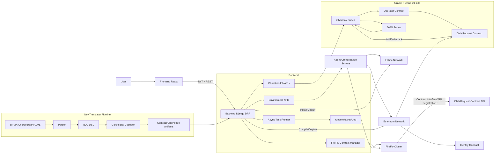

# System Architecture

## Core Interaction Flows

1. **Environment setup**
   - Frontend triggers `init -> join -> start -> activate` via Backend APIs.
   - Backend delegates container/network orchestration to Agent and records status in DB.

2. **DMN + Chainlink lite setup**
   - Backend starts Chainlink cluster + DMN lite scripts.
   - Deployment outputs are persisted into `EthEnvironment.chainlink_detail` and `dmn_detail`.
   - Task output is streamed into `runtime/tasks/task-<id>.log`.

3. **On-chain DMN request execution**
   - Business contract / caller triggers DMNRequest.
   - Operator + Chainlink job consumes request, calls DMN server, then writes result back to DMNRequest.

4. **FireFly integration**
   - Backend generates FFI from DMN ABI, registers interface/API in FireFly.
   - Later calls can be sent through FireFly API endpoint instead of direct Web3 calls.

5. **Translator integration**
   - BPMN parsed to B2C DSL, then code-generated into Solidity/Go artifacts.
   - Backend installs/deploys generated artifacts to Ethereum/Fabric environments.

## Backend Layering (Current)

1. **Route/View layer**
   - File: `src/backend/apps/environment/routes/environment/views.py`
   - Responsibility: validate request, enforce permission/state, create task, return HTTP response.

2. **Orchestrator layer**
   - `src/backend/apps/environment/services/chainlink_orchestrator.py`
   - `src/backend/apps/environment/services/identity_orchestrator.py`
   - `src/backend/apps/environment/services/dmn_firefly.py`
   - `src/backend/apps/environment/services/dmn_contract_executor.py`
   - Responsibility: complex domain workflow (script execution, external system integration, deployment sync).

3. **Task runtime layer**
   - File: `src/backend/apps/environment/services/task_runtime.py`
   - Responsibility: idempotency checks, async runner lifecycle, rollback apply, task log streaming.

4. **External integration libraries**
   - FireFly manager: `src/backend/common/lib/ethereum/firefly_manager.py`
   - Identity flow: `src/backend/common/lib/ethereum/identity_flow.py`
   - HTTP helpers: `src/backend/common/utils/http_client.py`
   - Responsibility: protocol-level API interaction and retry/timeout behavior.

5. **Persistence model layer**
   - Environment/task models: `src/backend/apps/environment/models.py`
   - Ethereum identity/deployment models: `src/backend/apps/ethereum/models.py`
   - Responsibility: status/detail fields (`chainlink_detail`, `dmn_detail`, `identity_contract_status`) and task records.

## Naming And Transaction Rules

1. **Naming consistency**
   - Workflow classes use unified `*Orchestrator` suffix.
   - Current orchestrators:
     - `ChainlinkOrchestrator`
     - `IdentityOrchestrator`
     - `FireflyOrchestrator`
   - Low-level protocol wrappers remain in `common/lib/*` (e.g. `FireflyContractManager`, `IdentityContractFlow`) and are consumed by orchestrators, not directly by routes.

2. **Transaction boundaries**
   - Route layer uses `task_runtime` helpers for task creation:
     - `create_task(...)`
     - `create_task_with_status_transition(...)`
   - Status switch + task creation are done atomically to avoid half-updated state.
   - Identity install/redeploy additionally wraps environment status and deployment status changes in `transaction.atomic()` before enqueueing async task.
